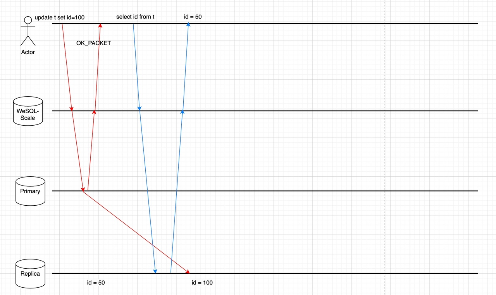
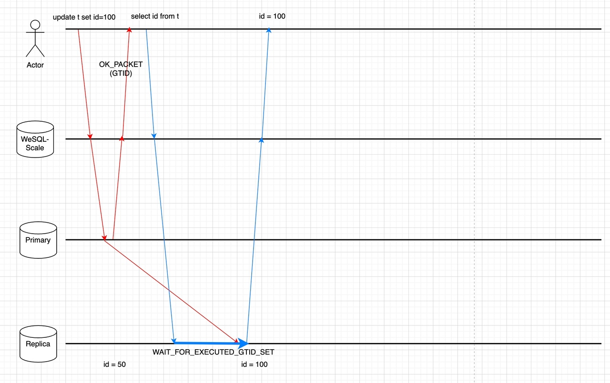

# 引言
随着现代应用对高可用性和可扩展性的需求不断增加，MySQL中对只读节点的需求也随之而来。随着用户数量和数据量的增长，将工作负载分布到多个节点以确保最佳性能变得至关重要。读写分离是一种实现这一目标的技术，它将数据查询路由至只读节点，从而减少主节点的负载并提高整体性能。
WeSQL WeScale 是一个高度兼容MySQL的数据库代理。它支持MySQL协议、读写分离、连接池化以及透明的故障切换。本文将介绍WeSQL WeScale读写分离的设计方案和技术实现。

# 读写分离
当用户为系统添加了一个只读节点后，往往需要修改应用配置或代码，以将SQL路由至只读节点或读写节点，这一过程通常较为复杂。
而WeSQL WeScale的读写分离则会对SQL进行解析，并使用抽象语法树（AST）来确定SQL的路由方式。通过分析用户的SQL，我们可以识别出它是只读查询语句、数据操作语言（DML）语句，还是需要在主节点上执行的特殊语句（如SELECT LAST_INSERT_ID()）。如果是只读查询语句，我们将其路由到只读节点；否则，则发送到读写节点。这一过程由WeSQL WeScale自动完成，用户无需进行繁琐的配置。

# 写后读一致性
在MySQL复制集群中，从库始终需要一些时间来与主库同步数据。因此，读取操作可能会被转发到滞后的从库中，从而无法返回同一客户端刚刚写入的最新数据。读写分离功能加剧了这一现象，因为它会自动将读取操作发送到从库中。
下图解释了为什么读取操作无法获取最新数据。

一些数据库代理会监听主从节点的复制延迟，并在复制延迟过高时禁用从库，但它们无法智能地确定何时可以安全地将特定SQL路由到从库。
WeSQL WeScale通过跟踪主节点和从节点之间的全局事务标识符（GTID），保证了写后读数据的一致性。

启用GTID后，每个事务（包括自动提交的事务）在成功提交后都会被分配一个GTID。随后从库MySQL实例会应用该事务并标记该GTID已执行。在此之后，我们可以确定在从库上读取数据是安全的。
## 技术细节

WeSQL WeScale 通过以下步骤确保所读取的数据是最新的，同时尽量避免引入额外的网络往返时间以保证性能：

**步骤1: 在写操作后获取GTID**
从MySQL 5.7开始，MySQL协议实现了一种机制（SESSION_TRACK_GTIDS），用于在响应包中收集需要通过网络传输的GTID。此功能帮助我们在写操作后获取GTID，而无需引入额外的网络往返时间。

**步骤2: 将GTID存储在WeSQL WeScale会话中**
在解析响应包并获取GTID后，WeSQL WeScale会将其存储在内存中。根据一致性级别，GTID可能会存储在客户端的会话中或全局内存数据结构中。稍后的读取操作将利用WeSQL WeScale内存中存储的GTID，以确保检索到之前写入的最新数据。具体步骤如下所示。

**步骤3: 选择一个从库进行读取**
WeSQL WeScale的内存中维护一个名为CLUSTER_GTID_EXECUTED的内存数据结构，它包含每个从库MySQL实例的@@global.gtid_executed值。CLUSTER_GTID_EXECUTED由健康检查模块定期更新，但它不可避免地会有滞后。
在读取操作的路由阶段，WeSQL WeScale将使用GTIDSet（我们在步骤2中获取的）基于CLUSTER_GTID_EXECUTED选择MySQL实例。
如果有一个MySQL实例的GTIDSet比读取操作请求的GTIDSet更新，我们可以直接将读取操作发送到该MySQL实例，确保其读取我们刚刚写入的数据。

**步骤4: 确保写操作已传播到从库MySQL**
所有从库MySQL实例可能都存在滞后，或者CLUSTER_GTID_EXECUTED由于某些原因可能已经过时。在步骤3中，可能没有从库可用于读取操作。
我们可以将读取操作发送到主库，或者将读取操作发送到带有WAIT_FOR_EXECUTED_GTID_SET前缀的从库。WAIT_FOR_EXECUTED_GTID_SET函数会一直等待，直到从库上执行GTID或超时。

我们可以使用多语句来节省一个网络往返：
```SQL
-- 例如，如果用户的SQL是：
select * from t1;

-- 发送到从库的实际SQL可能是这样的多语句：
select WAIT_FOR_EXECUTED_GTID_SET('ab73d556-cd43-11ed-9608-6967c6ac0b32:7', 3);select * from t1;
```
我们需要仔细处理MySQL协议才能使用多语句，否则MySQL连接可能会中断。

以上所有步骤都不会引入额外的网络往返。下图显示了为什么写后读功能确保读取操作能够获取最新的数据。


# 负载均衡
当有多个只读节点可用时，我们需要确定哪个节点应执行用户的SQL查询。不同的业务场景需要不同的负载均衡策略。例如，有时应用希望分散工作负载以提高资源利用率。其他时候，应用希望最小化响应时间以增强用户体验。
WeSQL WeScale实现了不同的负载均衡策略，赋予用户选择的权力。我们的负载均衡策略包括：
- **LEAST_QPS**: 在QPS最低的只读节点之间进行负载均衡。
- **LEAST_RT**: 在响应时间最低的只读节点之间进行负载均衡。
- **LEAST_BEHIND_PRIMARY**: 在滞后于主节点最少的只读节点之间进行负载均衡。
- **RANDOM**: 在可用的只读节点之间随机进行负载均衡。

WeSQL WeScale将与所有MySQL节点保持健康检查。因此，在节点故障切换事件中，WeSQL WeSQL WeScale能够自动检测到故障节点并将请求路由到健康节点。一旦节点恢复，WeSQL WeSQL WeScale将其标记为可用并发送请求。这整个过程不需要任何人工干预或应用配置更改。这一功能确保在故障切换期间的平稳运行和最小的停机时间。

# 结论
人们通常通过添加只读节点以提高可用性和可扩展性，但如果新添加的只读节点带来了一个额外的端点，可能会给开发者和应用程序带来很多额外的复杂性。例如，应用程序如何使用两个端点实现读写分离，并处理在分离读写流量后出现的写后读一致性和负载均衡问题。
本文解释了WeSQL WeScale针对这些问题的设计考虑，以及WeSQL WeScale如何处理所有这些问题，而无需复杂的配置和代码更改。
