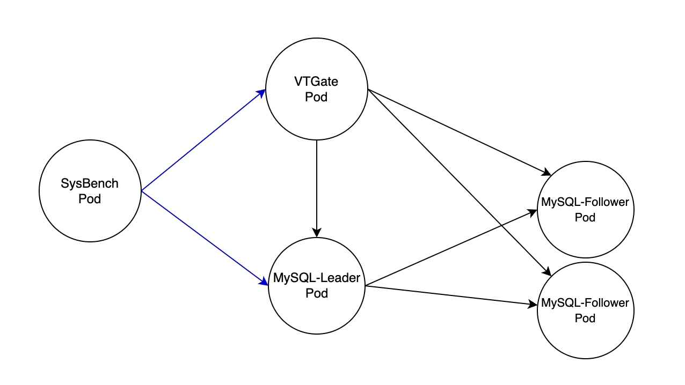

# 性能对比: WeSQL WeScale 与 MySQL

WeSQL WeScale 是一个兼容 MySQL 的数据库代理。它支持读写分离、连接池化和透明故障切换。这些功能共同作用，改善应用程序的可扩展性、性能、安全性和弹性。在本文中，我们将比较 WeSQL WeScale 与 MySQL 的性能，并研究这些功能如何影响吞吐量和延迟。让我们开始吧！

如果你赶时间，这里是一些关键点：

- 将 WeSQL WeScale 作为 MySQL 的代理可能会导致一些额外的网络往返，但随着工作负载的增加，它可以实现与直接连接 MySQL 相同的吞吐量和延迟。
- 由于连接复用，WeSQL WeScale 能够在高负载期间保持稳定的高吞吐量，而 MySQL 的性能可能因缓冲池被过多的连接占用内存而下降。
- 当启用读写分离功能时，即使 MySQL 达到瓶颈，随着压测线程数量的逐步增加，WeSQL WeScale 的吞吐量仍表现出线性增长。
- WeSQL WeScale 引入的额外内存消耗与 MySQL 相比可以忽略不计。
- WeSQL WeScale 引入的 CPU 开销仅占总资源消耗的三分之一左右。通过 WeSQL WeScale 的读写分离和横向扩展来增加 QPS 的性价比要高于通过 MySQL 的纵向扩展。

# WeSQL WeScale 与 MySQL 的基准测试

## 环境

> Kubernetes 版本：1.26.3
>
> 负载均衡器: slb.s2.small
>
> 机器: 4核16G
>
> SysBench: 均衡的读写工作负载

我们在 Kubernetes 中部署了一个 WeSQL WeScale 集群。SysBench 可以同时连接到 VTGate 和 MySQL，允许我们比较它们的性能。MySQL 集群由一个 Leader 和两个 Follower 组成。VTTablet 作为 MySQL Pod 中的 sidecar 部署。VTGate 和 SysBench 部署在各自的 Pod 中。每个 Pod 独占一台 4 核 16GB 的云服务器。

## MySQL vs WeSQL WeScale (禁用读写分离)

| 线程数 | WeSQL WeScale QPS | WeSQL WeScale 延迟 | MySQL QPS | MySQL 延迟 |
| --- | --- | --- | --- | --- |
| 4.00 | 2858.98 | 139.77 | 4638.01 | 86.20 |
| 8.00 | 4386.4 | 182.21 | 7508.50 | 106.48 |
| 16 | 6698.62 | 238.58 | 9654.44 | 165.67 |
| 25 | 8596.97 | 290.47 | 10968.65 | 227.77 |
| 50 | 11576.21 | 431.36 | 12440.1 | 401.39 |
| 75 | 12242.44 | 611.36 | 13055.7 | 573.76 |
| 100 | 12488.25 | 798.48 | 12998.67 | 767.69 |
| 125 | 12551.4 | 1389.39 | 12772.8 | 1366.46 |
| 150 | 12630.16 | 1579.17 | 12351.89 | 1614.56 |
| 175 | 12843 | 1745.59 | 12024.3 | 1864.79 |
| 200 | 12612.59 | 1972.6 | 11686.86 | 2132.42 |

一些观察:

- 当 SysBench 线程数较少时，WeSQL WeScale 的吞吐量低于直接连接 MySQL 时的吞吐量。这是由于引入了额外的网络往返。将应用程序与 VTGate 一起部署可以缓解这个问题。在大多数情况下，业务逻辑中的 SQL 查询比 SysBench 更复杂，因此网络的影响在现实中相对较小。
- 随着线程数量的增加，WeSQL WeScale 的性能和吞吐量开始接近甚至超过直接连接 MySQL 的性能。这是因为 WeSQL WeScale 支持连接复用。在相同的吞吐量下，它在 MySQL 端创建的连接更少，使 MySQL 能够为缓冲池分配更多内存。

在测试过程中，我们发现 MySQL 无法处理太多的 SysBench 线程，因为受限于 max_connection。我们不得不修改 max_connection 参数以便使用 200 个 SysBench 线程进行测试。然而，在 MySQL 中将 max_connections 设置为 100 时，WeSQL WeScale 可以处理超过 5000 个 SysBench 线程（由于服务器内存限制，我们无法进一步增加 SysBench 线程数量）。

上述测试证明了一点：引入 WeSQL WeScale 作为代理不会影响数据库的吞吐量。在高负载场景中，它甚至可以在连接增加时保持吞吐量不变。WeSQL WeScale 可以帮助你避免“连接过多”错误。

### WeSQL WeScale 引入的资源如何

| 线程数 | WeSQL WeScale CPU (m) | WeSQL WeScale 内存 (Mi) | MySQL CPU (m) | MySQL 内存 (Mi) |
| --- | --- | --- | --- | --- |
| 4 | 4916.74 | 30096.41 | 8036.75 | 30146.91 |
| 8 | 10913.25 | 30124.00 | 9685.58 | 30154.8 |
| 16 | 13206.75 | 30140.25 | 10240.5 | 30146.41 |
| 25 | 13961.66 | 30126.58 | 9692 | 30161 |
| 50 | 13820.16 | 30131.58 | 9895.25 | 30093.25 |
| 75 | 14413.75 | 30116.08 | 10398.75 | 30132.91 |
| 100 | 14553.08 | 30154.91 | 10446.41 | 30128.8 |
| 125 | 14511.24 | 30139.00 | 10440.58 | 30142.68 |
| 150 | 14942.08 | 30146.75 | 10859.91 | 30177.08 |
| 175 | 15190.50 | 30134.91 | 10797.58 | 30037 |
| 200 | 15280.75 | 30119.50 | 11137.25 | 30139.8 |

在我们的 SysBench 测试过程中，我们同时测量了两者的资源使用情况：
- WeSQL WeScale 引入的额外内存消耗与 MySQL 相比可以忽略不计。
- WeSQL WeScale 预计会消耗约多三分之一的 CPU 资源。

## MySQL 与 WeSQL WeScale (启用读写分离)

| 线程数 | WeSQL WeScale QPS | WeSQL WeScale 延迟 | MySQL QPS | MySQL 延迟 |
| --- | --- | --- | --- | --- |
| 4 | 2858.98 | 139.77 | 4638.01 | 86.2 |
| 8 | 4202.61 | 190.12 | 5252.91 | 152.18 |
| 16 | 6983.17 | 228.97 | 8303.15 | 192.53 |
| 25 | 9583.73 | 260.51 | 12807.06 | 195.02 |
| 50 | 12689.05 | 393.76 | 12631.39 | 395.28 |
| 75 | 15703.01 | 476.59 | 12642.1 | 592.75 |
| 100 | 17772.62 | 560.7 | 12907.98 | 773.19 |
| 125 | 19049.49 | 655.37 | 13028 | 957.99 |
| 150 | 20509.19 | 729.86 | 12994.45 | 1152.22 |
| 175 | 21289.84 | 820.12 | 12910.42 | 1352.38 |
| 200 | 22398.34 | 931.08 | 12537.16 | 1531.23 |

一些观察:

- 当 WeSQL WeScale 启用读写分离时，Leader 节点的 QPS 高于未启用读写分离时的 QPS。这是因为部分读取流量被路由到 Follower 节点。
- 随着 SysBench 线程数的不断增加，MySQL 的 QPS 会达到瓶颈，无法继续增长，但由于争用，延迟会继续增加。
- WeSQL WeScale 的 QPS 可以继续增长，而延迟比 MySQL 低，QPS 几乎是之前的两倍。

上述测试证明了一点：通过引入 WeSQL WeScale 作为代理，它可以横向扩展并利用 Follower 节点资源，从而提高集群的读写性能。

### WeSQL WeScale 引入的资源如何

| 线程数 | WeSQL WeScale CPU (m) | WeSQL WeScale 内存 (Mi) | MySQL CPU (m) | MySQL 内存 (Mi) |
| --- | --- | --- | --- | --- |
| 4 | 9313.58 | 30147.91 | 8507.58 | 30215.75 |
| 8 | 12382.00 | 30123.74 | 10054.8 | 30120.8 |
| 16 | 14923.64 | 30136 | 10851.99 | 30120.75 |
| 25 | 15933.00 | 30090.1 | 10491 | 30188.91 |
| 50 | 16377.66 | 30119.25 | 9986.58 | 30179 |
| 75 | 15982.91 | 30193.91 | 9882.91 | 30168.91 |
| 100 | 16423.68 | 30179.58 | 10180 | 30198.58 |
| 125 | 16628.91 | 30182 | 10516.58 | 30208.75 |
| 150 | 16805.75 | 30184.68 | 10410.66 | 30199.41 |
| 175 | 17098.58 | 30182.49 | 10584.91 | 30189.58 |
| 200 | 17211.50 | 30202.25 | 10745.66 | 30185.91 |

- 在所有工作负载场景中，集群的整体内存资源使用与 MySQL 相似，这表明 WeSQL WeScale 只需要极少量的内存。
- 尽管 QPS 几乎翻倍，但 WeSQL WeScale 引入的额外 CPU 仅占 MySQL 的 70%。这表明通过读写分离功能进行横向扩展的性价比相对较高。

# 结论

总之，引入 WeSQL WeScale 作为代理可以显著提高 MySQL 数据库的可扩展性、性能、安全性和弹性。启用读写分离后，WeSQL WeScale 可以利用 Follower 节点资源，从而提高集群的读写性能。此外，WeSQL WeScale 引入的开销很小，其通过读写分离和横向扩展来增加 QPS 的性价比要高于通过 MySQL 纵向扩展的性价比。