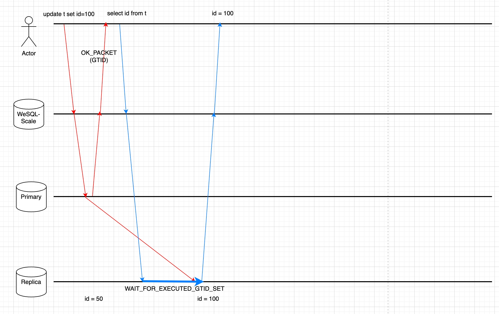

# 20230414_写后读 (ReadAfterWrite)

- 功能: 写后读 (ReadAfterWrite)
- 开始日期: 2023-04-14
- 作者: @earayu
- RFC PR: https://github.com/WeSQL/WeScale/pull/23
- WeSQL WeScale 问题: https://github.com/WeSQL/WeScale/issues/20

# 摘要

本文提议在 WeSQL WeScale 中添加写后读 (ReadAfterWrite) 功能。

写后读功能将确保读取操作能够获取到刚刚写入的数据。这将为客户端带来更好的用户体验，并提高开发人员的工作效率。

# 动机

在一个复制的 MySQL 集群中，从库通常需要一些时间来重放来自主库的二进制日志。因此，读取请求可能会被转发到滞后的从库，导致无法获取到同一客户端刚刚写入的数据。读写分离功能加剧了这种现象，因为它会自动将读取请求发送到从库。

提出写后读功能是为了应对在复制的 MySQL 集群中读取请求被转发到滞后的从库，从而导致客户端无法获取刚刚写入的数据的这一问题。

该功能将支持在写入请求之后需要立即读取最新数据的用例，例如在高流量的应用程序中，或在处理时间敏感数据时。

下图显示了为什么读取请求无法获取到最新数据。


# 技术设计

## 目标

1. 会话级别的写后读：确保在同一客户端连接中的读取请求能够获取到最新的写入数据。
2. 实例级别的写后读：确保在 WeSQL WeScale 实例中的读取请求能够获取到最新的写入数据。

## 非目标

1. 跨 WeSQL WeScale 实例的写后读不受支持，因为这需要将全局事务标识符 (GTID) 存储在线性一致的存储中，而这会很慢。
    1. 一种替代方案是用户手动在客户端连接之间传递 GTID。
2. 写后读并不意味着“随意读”或“单调读”。它保证的是，当发出读取请求时，返回的一定是已经写入的数据，而不是之前读取的数据。
    1. 单调读可能会在后续版本中得到支持。

## 设计细节

如果启用了 GTID，每个事务（包括自动提交的事务）在成功提交后将获得一个 GTID。

从库 MySQL 实例稍后将应用该事务并标记 GTID 已执行。

写后读功能通过以下步骤确保数据的新鲜度：

### 第一步：在写操作后获取 GTID，无需额外的网络往返

从 MySQL 5.7 开始，MySQL 协议实现了一种机制，允许在响应包中收集并发送 GTID。这一功能帮助我们在不引入额外网络往返的情况下获取 GTID。

启用该功能的步骤：

- 客户端需要在通过 MySQL 协议连接到 MySQL 时设置 Capability 标志 `CLIENT_SESSION_TRACK`。这将使 MySQL 将跟踪信息返回给客户端。
- 客户端还需要发出 `SET @@SESSION_TRACK_GTIDS = 'OWN_GTID'`，以指示 MySQL 在 OK 包中返回 GTID。这个系统变量会跟踪最后一次 DML 和 DDL 提交的 GTID。

### 第二步：在 WeSQL WeScale 会话中存储 GTID

在解析响应包并获取 GTID 后，WeSQL WeScale 将其存储在内存中。

根据一致性级别，GTID 可能存储在客户端的会话中或全局内存数据结构中。

后续的读取操作将利用存储在 WeSQL WeScale 内存中的 GTID，以确保能够检索到之前写入的数据。有关更多细节，请参见以下步骤。

### 第三步：选择一个 MySQL 从库进行读取

在 WeSQL WeScale 的内存中维护一个 `CLUSTER_GTID_EXECUTED` 内存数据结构，它包含集群中所有 `@@global.gtid_executed` 的值。`CLUSTER_GTID_EXECUTED` 由健康检查模块定期更新，并且显然会有滞后。

因此，步骤 1 中的 GTID 将不断更新 `CLUSTER_GTID_EXECUTED`。

在读取操作的路由阶段，它将使用 GTID（来自会话或全局内存数据结构）根据 `CLUSTER_GTID_EXECUTED` 选择一个 MySQL 实例。

只要选定的 MySQL 实例包含读取操作的 GTID，读取操作就可以直接转发到该 MySQL 实例。

### 第四步：确保写入请求已传播到从库 MySQL

所有从库 MySQL 实例都可能存在滞后，或者 `CLUSTER_GTID_EXECUTED` 可能由于某些原因已经过时。在步骤 3 中，可能没有可用的从库（主库始终持有所有数据）用于读取操作。

我们可以将读取操作发送到主库，或者将读取操作发送到带有 `WAIT_FOR_EXECUTED_GTID_SET` 前缀的从库。`WAIT_FOR_EXECUTED_GTID_SET` 函数将等待，直到从库上执行 GTID 或超时。

我们可以使用多语句来节省一个网络往返：

```jsx
-- 例如，如果用户的 SQL 是：
select * from t1;

-- 发送到从库的实际 SQL 可能是这样的多语句：
select WAIT_FOR_EXECUTED_GTID_SET('ab73d556-cd43-11ed-9608-6967c6ac0b32:7', 3);select * from t1;
```

我们需要仔细处理 MySQL 协议以使用多语句，否则 MySQL 连接可能会中断。

### 总结

上述所有步骤不会引入额外的网络往返，因此性能得到了保证。

用户需要启用 GTID 才能启用此功能。

下图显示了为什么写后读功能确保读取请求能够获取到最新数据。


### 路线图

- [x] 实现会话级别的写后读（步骤 1、2、4）
- [x] 实现实例级别的写后读（补充步骤 2、4）
- [x] 实现 `CLUSTER_GTID_EXECUTED` 数据结构（步骤 3）

## 用法

### 启用写后读

用户可以通过设置系统变量来启用此功能：
```MySQL
set @@read_after_write_consistency='EVENTUAL'; -- 默认
set @@read_after_write_consistency='SESSION';
set @@read_after_write_consistency='INSTANCE';
```

用户可以为 `WAIT_FOR_EXECUTED_GTID_SET` 函数设置超时时间：
```MySQL
set @@read_after_write_timeout = 30; -- 默认 30 秒
set @@read_after_write_timeout = 0.1; -- 100 毫秒
set @@read_after_write_timeout = 0; -- 不会超时，永久等待
```

# 未来工作

未来可能会支持单调读。单调读意味着用户将获得越来越新的数据。假设用户连接到 WeSQL WeScale 并运行两次相同的读取操作。如果启用了读写分离功能，第二次读取操作可能会在应用了较少 GTID 的 MySQL 节点上执行，因此与第一次读取相比，第二次读取会返回陈旧数据。

# 参考文献

- ProxySQL 的解决方案: [https://proxysql.com/blog/proxysql-gtid-causal-reads/](https://proxysql.com/blog/proxysql-gtid-causal-reads/)
- MaxScale 的解决方案: [https://mariadb.com/docs/architecture/components/maxscale/routers/readwritesplit/ensure-causal-consistency-maxscale-read-write-split-router/](https://mariadb.com/docs/architecture/components/maxscale/routers/readwritesplit/ensure-causal-consistency-maxscale-read-write-split-router/)