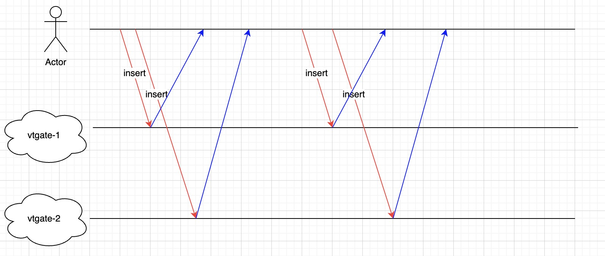

# 20230609_压缩GtidSets

- 功能: 压缩GtidSets
- 开始日期: 2023-06-09
- 作者: @gerayking
- RFC PR: https://github.com/wesql/wescale/pull/103
- WeSQL WeScale 问题: https://github.com/wesql/wescale/issues/37

# 背景

有关更多相关信息，请参考 [20230414_写后读 (ReadAfterWrite)](https://github.com/apecloud/wescale/blob/vitess-release-16.0-dev/doc/design-docs/RFCS/20230414_ReadAfterWrite.md)

## 为什么 gtidSets 会不连续？

在 WeSQL WeScale 的上下文中，有两个级别的写后读（Read After Write, RAW），即实例级别和会话级别。目前，会话级别的 GTID 存储最新的 GTID ，而实例级别的解决方案涉及在 vtgate 的内存中维护一个 gtidSets 并将其写入要执行的 SQL（例如 select 语句）中。本文仅关注实例级别的解决方案。当有多个 vtgate 在运行时，例如 vtgate1 和 vtgate2，并且多个 SQL 分散到这些 vtgate 访问时，vtgate1 和 vtgate2 中维护的 gtidSet 将出现许多内部碎片。以下图片描述了涉及两个 vtgate 的场景。



vtgate1:
`gtidset=df74afe2-d9b4-11ed-b2c8-f8b7ac3813b5:25081:25083:25085:25087`

vtgate2:
`gtidset=df74afe2-d9b4-11ed-b2c8-f8b7ac3813b5:25709-25080:25082:25084:25086:25088`

## 为什么需要压缩 GtidSets？

有关相关问题，请参考 [#37](https://github.com/apecloud/wescale/issues/37)

## 摘要

旨在压缩 GTID 集合，以防止 SQL 命令变得过长。

# 技术设计

## 何时需要压缩 GtidSet？

我们进行了一些权衡，最终决定在心跳包返回后执行压缩。此外，还有一个优化，即当 gtidSet 的长度超过某个阈值时触发压缩。

## 设计细节

每个 VTGate 负责维护 gtidset，这代表了该 VTGate 实例对现有 GTID 的最新理解。在执行阶段，VTGate 需要使用 gtidset 来确保写后读一致性。

要压缩 GTID 集合，我们需要从每个 MySQL 实例获取 GTID 集合，并将其与 vtgate 内部维护的 gtidset 合并。

### 第一步：从 tablet 获取 GTID 集合

在 `tablet_health_check` 中，vtgate 向 vttablet 发送心跳包。心跳包的响应携带当前 vttablet 及其对应的 MySQL 实例的 gtidset。因此，可以从响应中推导出每个 tablet 的 Gtid 集合。

### 第二步：使用 lastseengtid 压缩 GtidSet

+ 获取所有 MySQL GTID 集合的交集。
  例如：

```yaml
    tablet1: 1~5,7~10
    tablet2: 1~4,8~12
    tablet3: 1~4,7~9
     
    inttersectionSet（交集）: 1-4:8-9
```

+ 合并 intersectionSet 和 lastSeenGtid。
  lastSeenGtid 是指由 vtgate 维护的 gtid 集合。在本节中，我们使用 `mysql56GtidSet.Union` 函数进行实现。
    + 首先，截断 intersectionSet 中大于 lastSeenGtid 的部分。
      例如：

```yaml
        lastSeenGtid: 1~3,5~6
        inttersectionSet after cut off: 1~4
```

    + 然后，计算 lastSeenGtid 和截取后部分的并集。

最终结果：1~6

### 结论

在心跳包返回后，我们在 vtgate 中压缩 gtidset。在多个 vtgate 的场景中，我们确保了写后读（RAW）的一致性，并防止了 SQL 语句过长。然而，该机制仍然依赖于所有 MySQL 实例的心跳包返回。

# 未来工作

鉴于当前机制仍然依赖于心跳包的返回，未来有必要主动监控 gtidset 的长度，并主动同步每个 MySQL 实例的 gtidset。

# 参考文献

- 20230414_ReadAfterWrite: [https://github.com/wesql/wescale/blob/main/doc/design/20230414_ReadAfterWrite.md](https://github.com/wesql/wescale/blob/main/doc/design/20230414_ReadAfterWrite.md)
