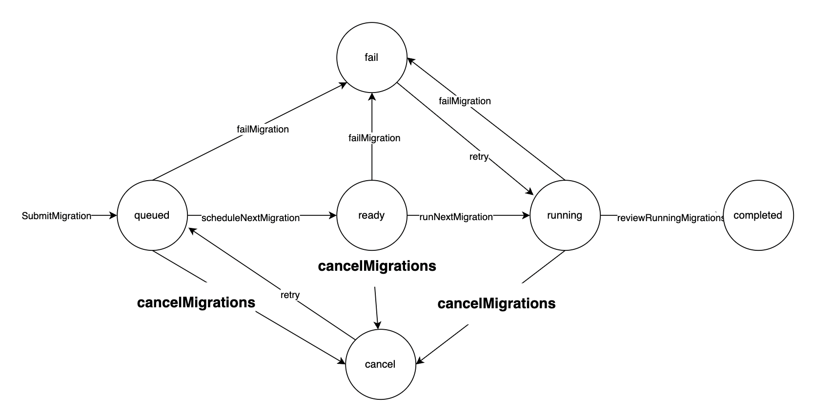

# **深入理解Online DDL调度器**

## **简介**

Online DDL的生命周期从插入到 **`schema_migration`** 表中开始。本文详细解释了状态转换发生的时机，以及在每个状态下vttablet执行的操作。

## **状态**

Online DDL的状态包括 **`queued`**（排队）、**`ready`**（准备）、**`running`**（运行中）、**`complete`**（完成）、**`fail`**（失败）、**`cancel`**（取消）和 **`pause`**（暂停）。

- **`queued`**（排队）: 新创建的Online DDL，初始状态。
- **`ready`**（准备）: Online DDL已准备好执行。
- **`running`**（运行中）: Online DDL正在进行中，包括创建影子表、生成select和insert语句，以及启动Vreplication任务。
- **`complete`**（完成）: Online DDL执行完毕，在切换完成后进入此状态。
- **`fail`**（失败）: 由于内部错误导致执行失败。可以通过使用相应的uuid查询 **`message`** 字段来诊断错误详情。
- **`cancel`**（取消）: WeSQL 提供 **`alter schema_migration`** 命令来取消Online DDL任务。处于此状态的任务可以使用 **`retry`** 命令重新执行。
- **`pause`**（暂停）: 目前正在开发中，此功能可以暂停处于 **`queue`**、**`ready`** 或 **`running`** 状态的Online DDL任务。

状态转换图（需要更新以加入 **`pause`** 状态）：

## **调度**

在主vttablet中，定期执行 **`onMigrationCheckTick`** 以更新DDL的状态。每次调用此函数都会更新状态机的当前状态。

- **`queued`** → **`ready`**: 在每次onMigrationCheckTick执行中，只有一个Online DDL任务可以从 **`queued`** 状态移动到 **`ready`** 状态。此状态旨在支持 **`postpone-complete`** 功能，调度具有最小ID的 **`queued`** Online DDL到 **`ready`**。注意，具有 **`-postpone-complete`** 的DDL不会在此周期内被调度。
- **`ready`** → **`running`**: 从 **`ready`** 到 **`running`** 的转换需要检查当前是否有Online DDL正在运行。默认情况下，WeSQL只允许一个DDL处于 **`running`** 状态。然而，你可以为Online DDL设置 **`allow-concurrent`** 标志，以允许并行执行。在并行模式下，vttablet会检查调度的DDL是否与正在运行的DDL冲突，方法是检查它们是否在同一张表上执行DDL。
- **`running`** → **`complete`**: 对于简单的DDL如创建和删除操作，不需要特定操作。对于删除表操作，WeSQL内部有一个 tableGC 函数，参考相关文章。对于变更DDL，在从 **`running`** 到 **`complete`** 的转换过程中，会进行切换操作（使用新创建的影子表替换原始表）。关于切换如何执行的详细信息，请参考相关文档。
- **`status`** → **`fail`**: 任何导致Online DDL执行失败的内部错误都会导致进入 **`fail`** 状态。如果处于 **`fail`** 状态，可以通过查询Online DDL的uuid对应的 **`message`** 字段来诊断错误。
- **`status`** → **`cancel`**: 使用 **`cancel`** 命令取消的Online DDL任务将进入此状态。执行 **`retry`** 将重新启动DDL，但不会从中断点恢复。

## **时间线**

- 影子表在何时为变更操作创建：影子表的创建和其他操作发生在 **`ready`** 到 **`running`** 的转换过程中。
- 变更操作的切换何时发生：当源表与目标表（影子表）之间的差异低于某一阈值时，主tablet会执行切换。此过程将短暂锁定表。
- 在 **`running`** 状态下Vreplication在做什么：有关详细信息，请参阅Vreplication文档。