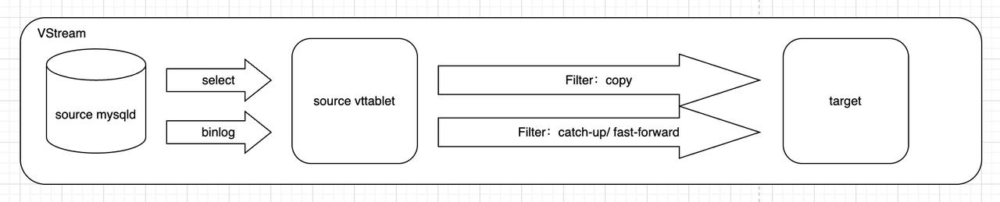
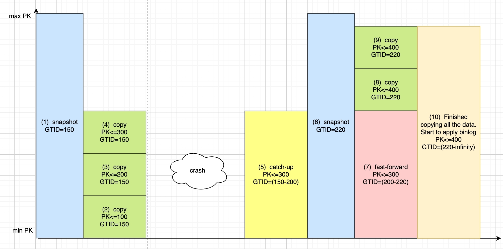

# **Vreplication**

## **简介**

Vitess 包含一个重要的功能，称为 VReplication。它广泛应用于各种数据同步场景中，包括Online DDL、分片重组（Resharding）、表迁移（MoveTable）、物化视图（MaterializeView）等。VReplication 可以被概念化为两个逻辑表之间的 ETL（提取、转换、加载）管道。它由一个或多个 VStreams 组成，每个 VStream 代表两个 mysqld 实例之间的一个 ETL 管道。本文旨在阐明 VStream 的内部细节。

## **结构**

下图展示了 VStream 的架构。



在启动 VStream 时，它首先启动一个快照事务以复制整个数据集，这可能需要相当长的时间。接下来，它会启动二进制日志（binlog）以进行持续的增量数据同步。一旦源表和目标表之间的延迟足够小，就可以执行切换操作。在数据同步过程中，可以进行各种转换操作，如过滤和投影。此外，VStream 支持故障恢复，这为其算法增加了复杂性。

## **原理**

要将数据从源表复制到目标表（包括全量和增量），有一个简单的做法：

1. 锁定源表；然后，在源表上启动一个具有一致性快照的事务，并随后释放锁定。
2. 读取快照数据并将其全部复制到目标表。（请注意，此时读写事务仍在修改数据。）
3. 在第一步中，我们还获取了事务的 GTID。一旦第二步完成，我们就可以从该 GTID 位置开始复制 binlog。
4. 继续将 binlog 复制到目标表，直到源表和目标表之间的复制延迟最小。

这是 VReplication 复制算法的基本原理。VReplication 在此基础上进行了工程优化和额外的机制，以处理故障恢复。

## **完整算法描述**

基于上述的简单算法，如果我们考虑故障恢复，一个天真的想法是，在复制过程中记录主键（PK），并在发生故障时从该 PK 位置恢复。过程如下：

```bash
-- VReplication 开始，通过快照复制表中的所有数据
SNAPSHOT 1:
select * from X; -- GTID:150
<目标端批量插入数据，记录插入的最高 PK，例如 pk=300>

<崩溃 ................>

SNAPSHOT 2:
select * from X where pk > 300; -- GTID: 200
<目标端批量插入数据>
```

但是，这里存在一个问题：在 SNAPSHOT 1 和 SNAPSHOT 2 之间，GTID 从 150 增加到 200，这可能涉及对 “PK<=300” 的数据进行更新。

那么，我们该怎么办？

我们可以应用一个修正：在启动 SNAPSHOT 2 之前，读取 "**`GTID>=150 和 PK<=300`**" 的 binlog 并在目标端重放。过程如下：

```sql

-- VReplication 开始，通过快照复制表中的所有数据
SNAPSHOT 1: select * from X; -- GTID:150
COPY 1: <目标端批量插入数据，它还记录了插入的最高 PK，例如 300>

<崩溃 ................>

这一步称为catch up：应用 binlog PK<=300，GTID>=150 -- 持续应用直到赶上最新的 GTID，例如 200。然后停止并继续复制。 SNAPSHOT 2: select * from X where pk > 300; -- GTID: 220
COPY 2: <目标端批量插入>
```

*(PS: 绿色背景的文本表示 VReplication 复制算法的基本操作。)*

但我们发现了另一个问题：在停止 binlog 应用之后，在 SNAPSHOT 2 之前，存在一个时间间隙，在此期间数据可能已经被修改。

那么我们该怎么办？

我们可以应用另一个修正：在启动 SNAPSHOT 2 之后，在目标端开始消费数据之前，读取 "**`200<=GTID<=220, PK<=300`**" 的 binlog 并在目标端重放。过程如下：

```sql

-- VReplication 开始，通过快照复制表中的所有数据
SNAPSHOT 1: select * from X; -- GTID:150
COPY 1: <目标端批量消费，通过批量插入。它还记录了插入的最高 PK，例如 300>

<崩溃 ................>

这一步称为catch up：应用 binlog: PK<=300，GTID>=150 -- 持续应用直到赶上最新的 GTID，例如 200。然后停止并继续复制。 SNAPSHOT 2: select * from X where pk > 300; -- GTID: 220
这一步称为fast forward：应用 binlog PK<=300, 200<=GTID<=220
COPY 2: <目标端批量消费>

```

*(PS: 绿色背景的文本表示 VReplication 复制算法的基本操作。)*

**我们可以得出的一个重要结论是，在执行fast forward后，PK<=300 的数据的物理版本将与 SNAPSHOT 2 中的相同。**

然后，SNAPSHOT 2 可以继续复制过程。

> 一个值得思考的问题：为什么catch up步骤是必要的？它可以被省略吗？
>

## **算法流程图**

如上所述，典型的 VReplication 过程如下图所示，在过程中经历了一次崩溃恢复。括号中的数字表示操作的顺序。



(1) 以可重复读隔离级别启动，启动一个一致性快照事务。

(2)(3)(4): 进行全量复制，复制 PK≤300 的数据。

崩溃: 此时，由于未知原因，服务器崩溃。

(5): 在服务恢复后，执行了一些 SQL 操作，涉及到 PK≤300 的 DML，需要通过catch up来更新这些数据。

(6): 再次拍摄快照。

(7): 在快照过程中，可能会对 PK≤300 的行进行更多的 SQL 更新，因此需要进行fast forward。

(8)(9): 全量复制，复制 PK≤400 的数据。

(10): 持续的 binlog 同步。

注意: (6) 中的 SNAPSHOT 2 仅针对 PK>300 的数据。因此，在进行它之前和之后，必须对 PK≤300 的数据执行catch up和fast forward。通过catch up和fast forward，即使在崩溃后，SNAPSHOT 2 时 PK<300 的数据也将与 GTID 220 时的数据相同，确保 SNAPSHOT 2 期间的所有数据（PK<300，PK>=300）均为 GTID 220 时的最新状态。

注意: 图中的 (8)(9) 中的 pk<= 数字不应全为 400。这两个过程表示在fast forward完成后从 PK>300 继续复制。

## vreplication和vstream的关系
vstream实现了上述提到的ETL过程，即全量复制，并在程序崩溃时执行catch up、fast forward算法以保证ETL的正确性。vreplication调用了vstream，并在其基础上进行修改，例如：vstream的catch up和fastforwad阶段并不会对PK进行过滤，而vreplication在vstream返回的数据基础上，增加了对PK的过滤。

# 参考文献
[Life of a Stream: How VReplication Replicates Data](https://vitess.io/docs/16.0/reference/vreplication/internal/life-of-a-stream/)

[Analyzing VReplication behavior](https://github.com/vitessio/vitess/issues/8056)

[RFC VStream Copy: streaming events from the beginning](https://github.com/vitessio/vitess/issues/6277)

[VSCopy: Resume the copy phase consistently from given GTID and lastpk](https://github.com/vitessio/vitess/pull/11103)