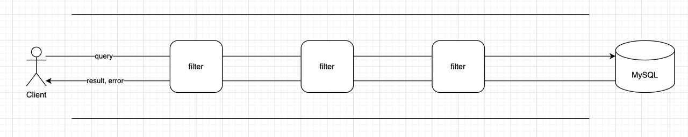
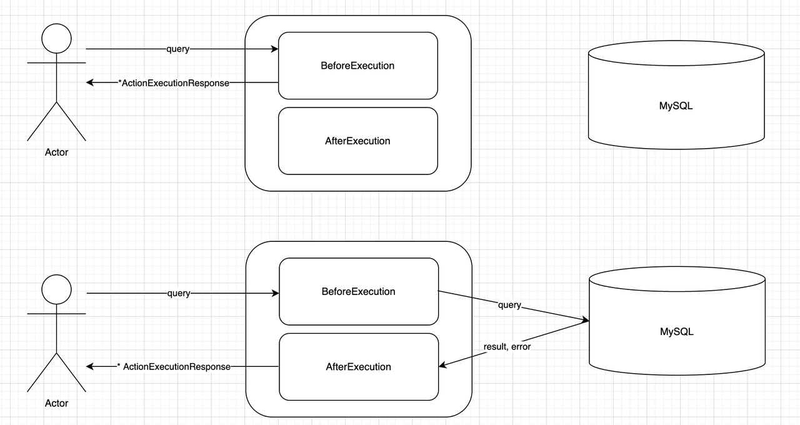
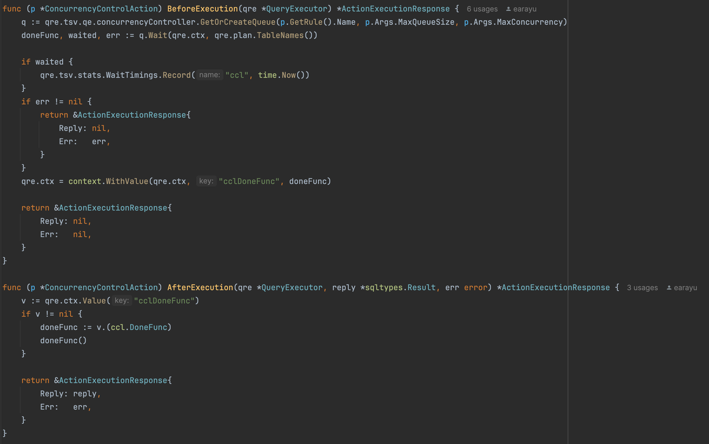

# filter

- 功能名称: filter
- 开始日期: 2024-05-14
- 作者: @earayu

## **简介**

随着微服务架构的兴起，API 网关在复杂系统中开始扮演越来越重要的角色。与“RPC 调用”相关的大多数“通用需求”通常在 API 网关层处理，例如日志记录、协议转换、身份验证、DDoS 保护、限流等。

为此，API 网关通常提供一种“filter模式”，使开发人员能够轻松实现这些需求。filter模式的本质是模式匹配与自定义操作的结合。

作为数据库代理，WeScale 在处理用户请求时与 API 网关有许多类似的需求。因此，我们提议在 WeScale 中实现一个filter框架，受 API 网关的filter模式启发，使任何人都能通过简单的代码扩展 WeScale 的功能。

具体流程如下：
1. 用户发送 SQL 查询，基于 SQL 信息，匹配多个filter。
2. SQL 查询通过多个filter，每个filter都可以修改 SQL 信息。
3. MySQL 执行 SQL 查询。
4. SQL 查询按相反顺序通过filter，然后返回给用户。
   

## **模式匹配**

### 需求 1: 从 SQL 中收集信息

我们可以从 SQL 中收集大量信息，这些信息通常可以分为两类：

1. **计划信息**: 可以从 SQL 计划中获得的信息，如 SQL 类型、数据库名称、表名称、SQL 模板等。
2. **执行信息**: 可以在单个 SQL 查询的实际执行过程中获得的信息，如客户端 IP、用户名、特定参数和参数值。

#### 计划信息包括
1. **SQL 类型**: SELECT、UPDATE、INSERT、DELETE
2. **对象类型**: 数据库名称、表名称、视图名称
3. **SQL 模板**: 例如 `SELECT * FROM d1.t1 WHERE c1 = ? AND c2 = ?`

#### 执行信息包括
1. **用户，客户端 IP**: 例如 `foo@112.45.41.135`
2. **SQL 谓词**: 例如 `c1 = 1`，`c2 >= 2`

### 需求 2: 设计一个高性能的限流规则匹配算法

#### 一个简单的算法:
1. 假设我们有 100 条规则，每条规则平均有 3 个条件。
2. 对于每次 SQL 执行，我们必须顺序检查所有 100 条规则是否匹配。
3. 这可能需要多达 300 次表达式评估。

#### 使用计划缓存的优化算法:
我们知道每次 SQL 执行都会进行“参数化”（规范化）然后生成“计划”。当下一次收到类似的 SQL 时，可以直接从缓存中获取计划，而不是重新生成。

由于我们已经将 SQL 信息分为计划信息和执行信息两类，我们可以优化上述简单算法：

1. 假设我们有 100 条规则，每条规则平均有 2 个计划特定条件和 1 个执行特定条件。
2. 当第一次生成 SQL “计划”时，基于“计划条件”过滤的规则将与计划一起缓存。假设这次过滤后剩下 10 条规则。
3. 在 SQL 执行期间，这 10 条规则将直接从计划缓存中提取，并按顺序与“执行特定条件”进行匹配。
4. 这将表达式评估的次数减少到大约 10 次。

通过利用计划缓存并对规则进行分类，我们可以显著减少 SQL 执行时的计算负担。

## 自定义操作

如下图所示，任何filter操作都有两个函数：`BeforeExecution` 和 `AfterExecution`。它们的返回值都是 `ActionExecutionResponse`。

如果 `BeforeExecution` 函数返回非空的 `ActionExecutionResponse`，则查询将不再继续传播，而是直接返回给客户端。因此，如果filter操作希望返回模拟结果或错误，可以通过这种方式实现。

每个 `AfterExecution` 函数都有机会修改 `ActionExecutionResponse` 的值，因此它也可以更改结果和错误内容。此外，还可以在 `AfterExecution` 函数中执行资源清理任务。



```Go
type ActionInterface interface {
    BeforeExecution(qre *QueryExecutor) *ActionExecutionResponse

    AfterExecution(qre *QueryExecutor, reply *sqltypes.Result, err error) *ActionExecutionResponse
}

type ActionExecutionResponse struct {
    Reply *sqltypes.Result
    Err   error
}
```

### 内置操作

WeScale 提供了几种内置操作：

- **CONTINUE 操作**: 什么也不做。
- **FAIL 操作**: 返回错误。
- **BUFFER 操作**: 在一段时间内缓存 SQL。
- **CONCURRENCY_CONTROL 操作**: 控制 SQL 的并发性。
- ......

实现一个filter操作非常简单。例如，将并发控制功能添加到 WeScale 的主路径中，使用 `ConcurrencyControlAction` 只需要大约 30 行核心代码。


### WASM 操作

通过强大而灵活的模式匹配能力，支持用户定义的操作（通过引入 WASM），将使整个系统变得非常有趣。
你可以在 [这里](20240531_WasmPlugin.md) 找到 WASM 插件设计。