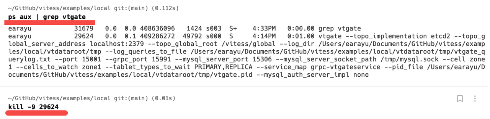
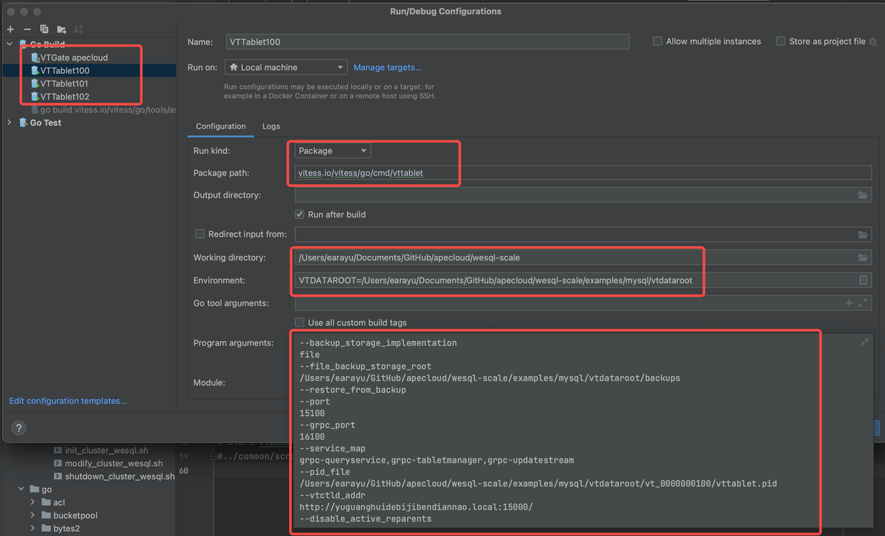

启动和调试本地集群
=====================

这篇文档解释了如何在你的本地机器上启动一个 WeSQL WeScale 集群并开始调试。我们尽量使这篇文档直观且有助于成功部署，但不可避免地，你可能会遇到一些导致失败的特殊情况。如果你遇到任何问题，请随时提交 issue。如果你愿意帮助改进这篇文档，我们也非常欢迎。

# **安装依赖项**

要在本地启动 WeSQL WeScale 集群，你需要依赖以下软件：mysqld、mysql、go、etcd。你可以使用以下命令检查它们是否已经安装。

```Bash
mysqld --version
mysql --version
go version
etcd --version
```

## **MacOS**

如果你使用的是 macOS，可以使用 Homebrew 来安装依赖项。

```Shell
brew install automake go mysql mysql-client etcd
```

通过 brew 安装 MySQL 和 etcd 后，它们会自动启动，但由于 WeSQL WeScale 将管理 MySQL 和 etcd 的启动和关闭，你需要先手动停止这些进程：

```Shell
brew services stop mysql
brew services stop etcd
```

## **Ubuntu**

如果你的本地机器上没有安装 mysqld 或 etcd，可以使用以下命令来安装它们。

至于 Go 的安装，你可以参考这个文档：https://go.dev/doc/install

```Shell
sudo apt-get update
sudo apt install -y mysql-server etcd 
```

## **Windows WSL**

在 WSL 上设置调试环境需要额外的操作，因为某些脚本可能无法以超级用户身份运行。默认情况下，WSL 是以超级用户身份运行的，因此我们需要创建一个普通用户。以下是具体步骤：

1. 首先，使用以下命令创建一个普通用户：
```shell
useradd -m 用户名   # 使用 -m 为用户创建一个主目录。
passwd 用户名       # 修改普通用户的密码。
usermod -aG sudo 用户名  # 允许该用户使用 sudo。
```

2. 由于调试环境是基于 GoLand 的，而 GoLand 连接到 WSL 终端时使用默认的 WSL 用户，我们需要将默认的 WSL 用户改为新创建的普通用户：
```shell
vim /etc/wsl.conf
# 添加以下内容：
[user]
default = 用户名
```

然后，打开 PowerShell 并关闭 WSL：
```shell
wsl --list --running   # 列出正在运行的 WSL 实例。
wsl --shutdown 实例名    # 用实际的实例名替换 '实例名' 以关闭该实例。
```

这样，当你再次进入 WSL 时，你将以普通用户身份登录。你还会注意到，GoLand 的终端也会以普通用户连接。

3. 以普通用户重新克隆源代码，因为由超级用户克隆的源代码可能会有权限问题。在克隆源代码之前，别忘了使用 `ssh-keygen` 为普通用户生成 SSH 公钥并将其配置在 GitHub 上。

# **构建与安装**

## **拉取源代码**

```Shell
git clone https://github.com/wesql/wescale.git
cd wescale
```

## **构建**

你可以使用 `make build` 命令来构建整个项目。如果编译成功，你可以使用 `ls bin` 查看是否已经生成了许多二进制可执行文件。

```Shell
make build
```

## 安装

WeSQL WeScale 的构建会花一些时间。一旦完成，你应该会看到一个 bin 文件夹，其中包含 WeSQL WeScale 的二进制文件。你需要将这个文件夹添加到你的 `PATH` 变量中，这样命令行就可以直接调用新生成的二进制文件。

```Shell
ls bin
export PATH={WeSQL WeScale 项目根路径}/bin:$PATH
```

# **部署与调试**

你可以使用 `wescale/examples/mysql` 文件夹中的脚本在本地部署一个 WeSQL WeScale 集群。

## **部署**

```Shell
cd examples/mysql
./init_cluster.sh
```

一旦 WeSQL WeScale 集群成功启动，你应该会看到这些消息：

```SQL
MySQL 端点:
mysql -h127.0.0.1 -P17100
mysql -h127.0.0.1 -P17101
mysql -h127.0.0.1 -P17102

VTGate 端点:
mysql -h127.0.0.1 -P15306
```

你可以使用以下命令连接到 WeSQL WeScale：

```Shell
mysql -h127.0.0.1 -P15306
```

## 调试

如果你想调试 `VTGate` 或 `VTTablet`，你可能希望在 IDE 中启动它们。

你可以终止由脚本启动的 vtgate/vttablet 进程，并在 IDE 中启动 vtgate/vttablet 进行调试。程序参数可以参考从 `ps aux` 命令获得的 vtgate 启动选项：



有一种方便的方法可以帮助你启动本地集群以进行调试。你可以在启动集群时添加一个环境变量 `debug=on`。

这将首先启动一个集群，然后所有的 vtgate 和 vttablet 进程将被终止。

```Shell
debug=on ./init_cluster.sh
```

以 VTTablet 为例：

你应该配置 `Run kind`、`Package path`、`Working directory`、`Environment` 和 `Program arguments`。

你可以按照图片中的设置进行配置，但记住要用你自己电脑上的文件路径替换路径。正如前面所说的，程序参数可以通过 `ps aux` 命令查看。



然而，当使用 `ps aux` 命令获取 `vttablet` 的程序参数信息时，`--tablet_hostname` 标志后面没有参数值，这会导致 GoLand 中出现错误。你可以通过在终端中运行 `hostname` 来获取主机名，然后将其用作 `hostname` 标志的值。

## 关闭

关闭集群。如果某些进程未能关闭，你可以手动终止所有进程并删除 `vtdataroot` 目录。

```Shell
./shutdown_cluster.sh
```