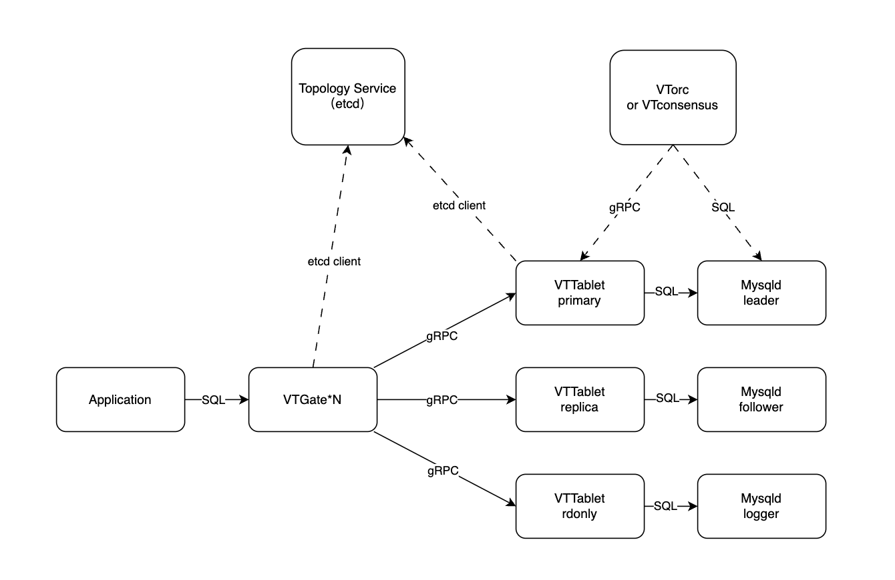

WeSQL WeScale 的架构
=====================

WeSQL WeScale 是一个开源的数据库代理项目，设计上高度兼容 MySQL 以及其他兼容 MySQL 的数据库如 MariaDB。它支持 MySQL 的通信协议，通过 SQL 解析技术实现读写分离，并提供读后写一致性、负载均衡和连接池功能。
本文档旨在提供关于 WeSQL WeScale 集群架构和关键组件的详细信息。

## 架构
下图展示了 WeSQL WeScale 集群的架构。

### VTGate
客户端应用程序通常通过标准的 MySQL 通信协议连接到 VTGate。VTGate 是无状态的，这意味着它可以轻松且有效地进行扩展，无论是在规模上还是性能上。对于用户而言，使用 VTGate 就像使用 MySQL。它负责解析 SQL 查询，并规划和路由这些查询到 VTTables。
我们在 VTGate 中实现了一些 WeSQL WeScale 的关键功能，如读写分离、读后写一致性和负载均衡。
VTGate 通过 gRPC 与 VTTablet 通信。

### VTTablet
VTTablet 通常作为 mysqld 的一个 sidecar 实现。如果 WeSQL WeScale 部署在 Kubernetes 中，那么 VTTablet 应该与 mysqld 位于同一个 pod 中。
类似于高可用的 MySQL 集群，集群中的每个 VTTablet 都有一个角色。VTTablet 的角色应该与 MySQL 的角色对应，并随之相应变化。VTOrc 和 VTConsensus 将帮助 VTTablet 完成角色转换过程，我们稍后会详细讨论。
VTTablet 接受来自 VTGate 的 gRPC 请求，然后将这些查询发送到 MySQL 上执行。VTTablet 处理了一些任务，如权限检查和日志记录，但它最重要的角色是确保正确的连接池管理。

### 拓扑服务
拓扑服务组件促进了 VTGate 和 VTTablet 之间的服务发现，同时也使它们能够存储有关集群的元数据。
通常情况下，拓扑服务由 etcd 提供，不过任何实现了拓扑服务 API 的存储服务都可以达到这个目的。

### VTOrc 和 VTConsensus
如果 MySQL 的角色发生变化，例如从主节点变为从节点，那么 VTTablet 的相应角色也应该随之改变。VTOrc（用于复制拓扑）和 VTConsensus（用于 Raft 共识拓扑）会检查 MySQL 集群的状态，并向 VTTablet 发送命令，要求它改变角色。
我们可能会在未来将它们合并为一个组件，并集成到 VTGate 中。这将简化部署拓扑，使 VTGate 和 VTTablet 能够更快地检测到 MySQL 角色的变化。

### MySQL 集群
VTTablet 将 SQL 命令发送到 MySQL 数据库执行。为了确保数据库即使在一个节点失败时仍然可用，MySQL 数据库架构通常由一个复制节点的集群或一个共识集群组成。
我们希望能够兼容不同版本和发行版的 MySQL。因此，当我们开发新功能时，我们会考虑到底层的 MySQL 可能是社区版、MariaDB 或其他变种。