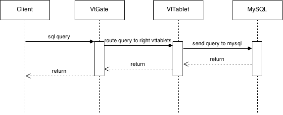
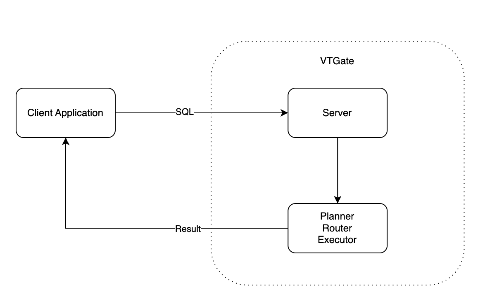
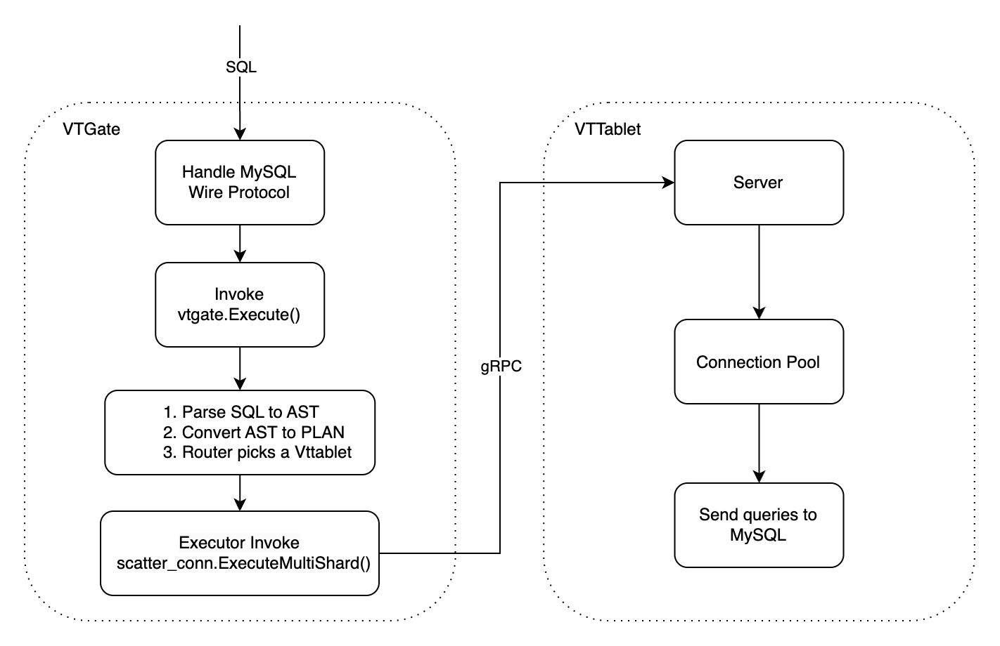
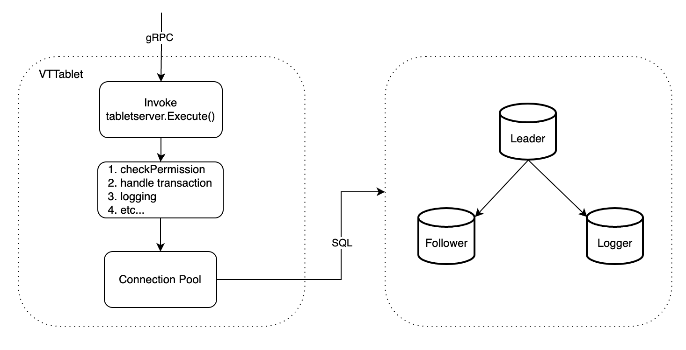

一次查询的生命周期
=====================

* [从客户端到VTGate](#from-client-to-VTGate)
* [从VTGate到VTTablet](#from-VTGate-to-VTTablet)
* [从VTTablet到MySQL](#from-VTTablet-to-mysql)
* [整合起来](#putting-it-all-together)

一次查询指的是一次向数据库请求信息的过程，在 Vitess 的场景下，这个过程涉及四个组件：客户端应用程序、VTGate、VTTablet 和 MySQL 实例。本文解释了这些组件之间以及组件内部发生的交互。

从整体上看，如图所示，首先客户端发送一个查询请求到 VTGate。VTGate 接收到请求后，解析查询并将其路由到正确的 VTTablet。每个接收到查询请求的 VTTablet 会进行必要的验证，然后将查询传递给底层的 MySQL 实例。在从 MySQL 收集到结果后，VTTablet 将响应发送回 VTGate。一旦 VTGate 收到来自 VTTablet 的响应，它就会将结果返回给客户端。如果 VTTablet 出现错误，VTGate 会在错误可恢复的情况下进行重试，只有当错误不可恢复或达到最大重试次数时，查询才会失败。

## 从客户端到 VTGate

VTGate 对客户端应用程序来说就像是 MySQL 一样。客户端应用程序首先将 SQL 查询发送到 VTGate。VTGate 的服务器会将 SQL 字符串解析为抽象语法树（AST），然后调用规划器、路由器、执行器来执行 SQL，最后将结果返回给客户端。

## 从 VTGate 到 VTTablet

VTGate 实现了 MySQL 的通信协议，这意味着它可以像 MySQL 数据库一样运行。当 VTGate 收到客户端的 SQL 查询并调用 `VTGate.Execute()` 方法后，它需要将 SQL 解析为 AST，然后由 `Planner` 将 `AST` 转换为 `PLAN`。由于 VTGate 是一个数据库代理，后端通常映射到多个 VTTablet，它需要选择一个 VTTablet 来执行 SQL。在 Router 模块中，我们实现了读写分离、读后写一致性和负载均衡等功能。在执行阶段，Executor 接收 `PLAN` 并最终通过 gRPC 请求将查询发送到 VTTablet 执行。

## 从 VTTablet 到 MySQL

一旦 VTTablet 收到来自 VTGate 的 gRPC 调用，它会在将查询传递给 MySQL 之前进行一些检查。首先，它会验证当前 VTTablet 的状态，包括会话 ID，然后生成查询计划并应用预定义的查询规则，并进行访问控制列表（ACL）检查。它还会检查查询是否命中行缓存，如果命中则立即返回结果。此外，VTTablet 会合并同时执行的重复查询，并在它们之间共享结果。最后，VTTablet 将从连接池中获取一个连接，将查询传递到 MySQL 层并等待结果。
连接池是 VTTablet 中最重要的组件之一。

## 整合起来
