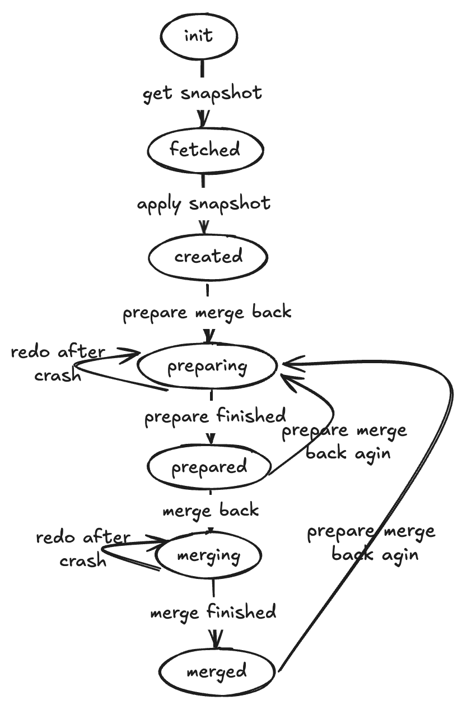

# 分支

## 概述

WeSQL中的Branch功能允许您将一个Wescale集群（**source**）中的数据库复制到另一个Wescale集群（**target**）。这个功能特别适用于创建与您的生产环境相似的开发数据库。本指南提供了使用Branch功能的清晰指令，包括其命令和选项。

**Source**指的是从中复制schema的Wescale集群，而**Target**指的是将schema应用到的Wescale集群。

---

## 一般语法

Branch命令的一般语法如下：

```
Branch <Action> [with ('key1'='value1', 'key2'='value2', 'key3'='value3');]
```

其中**Action**可以是以下之一：
- **create**
- **diff**
- **prepare_merge_back**
- **merge_back**
- **show**
- **delete**

---

## 动作概述

- **create**: 通过将数据库schema从source复制到target数据库来初始化分支工作流。
- **diff**: 显示source和target数据库schema之间的差异。
- **prepare_merge_back**: 准备将target的schema更改合并回source数据库。
- **merge_back**: 执行schema更改的合并。
- **show**: 显示分支元数据。
- **delete**: 删除分支元数据。

---

## 先决条件

### 创建集群

每个分支对应一个MySQL实例。因此，您需要两个Wescale集群：一个作为source，另一个作为target。您可以使用以下命令启动这两个Wescale集群。如果您已经在本地运行了一个Wescale集群，可以直接启动一个新的集群。

在这里，我们将使用端口**15306**上的Wescale集群作为source，另一个在端口**15307**上作为target。

```shell
docker network create wescale-network

# Source集群
docker run -itd --network wescale-network --name mysql-server \
  -p 3306:3306 \
  -e MYSQL_ROOT_PASSWORD=passwd \
  -e MYSQL_ROOT_HOST=% \
  -e MYSQL_LOG_CONSOLE=true \
  mysql/mysql-server:8.0.32 \
  --bind-address=0.0.0.0 \
  --port=3306 \
  --log-bin=binlog \
  --gtid_mode=ON \
  --enforce_gtid_consistency=ON \
  --log_replica_updates=ON \
  --binlog_format=ROW

docker run -itd --network wescale-network --name wescale \
  -p 15306:15306 \
  -w /vt/examples/wesql-server \
  -e MYSQL_ROOT_USER=root \
  -e MYSQL_ROOT_PASSWORD=passwd \
  -e MYSQL_PORT=3306 \
  -e MYSQL_HOST=mysql-server \
  -e CONFIG_PATH=/vt/config/wescale/default \
  apecloud/apecloud-mysql-scale:0.3.8-alpha4 \
  /vt/examples/wesql-server/init_single_node_cluster.sh

# Target集群
docker run -itd --network wescale-network --name mysql-server3307 \
  -p 3307:3307 \
  -e MYSQL_ROOT_PASSWORD=passwd \
  -e MYSQL_ROOT_HOST=% \
  -e MYSQL_LOG_CONSOLE=true \
  mysql/mysql-server:8.0.32 \
  --bind-address=0.0.0.0 \
  --port=3307 \
  --log-bin=binlog \
  --gtid_mode=ON \
  --enforce_gtid_consistency=ON \
  --log_replica_updates=ON \
  --binlog_format=ROW

docker run -itd --network wescale-network --name wescale15307 \
  -p 15307:15307 \
  -w /vt/examples/wesql-server \
  -e MYSQL_ROOT_USER=root \
  -e MYSQL_ROOT_PASSWORD=passwd \
  -e MYSQL_PORT=3307 \
  -e MYSQL_HOST=mysql-server3307 \
  -e VTGATE_MYSQL_PORT=15307 \
  -e CONFIG_PATH=/vt/config/wescale/default \
  apecloud/apecloud-mysql-scale:0.3.8-alpha4 \
  /vt/examples/wesql-server/init_single_node_cluster.sh
```

### 初始化数据

在连接到source Wescale后，运行以下命令：

```shell
docker exec -it wescale mysql -h127.0.0.1 -P15306
```

创建以下数据库和表：

```sql
DROP DATABASE IF EXISTS test_db1;
DROP DATABASE IF EXISTS test_db2;
DROP DATABASE IF EXISTS test_db3;
CREATE DATABASE test_db1;
CREATE DATABASE test_db2;

CREATE TABLE test_db1.users (
  id INT PRIMARY KEY AUTO_INCREMENT,
  username VARCHAR(50) NOT NULL,
  email VARCHAR(100) UNIQUE,
  created_at TIMESTAMP DEFAULT CURRENT_TIMESTAMP
);

CREATE TABLE test_db2.source_orders (
  order_id INT PRIMARY KEY AUTO_INCREMENT,
  customer_name VARCHAR(100) NOT NULL,
  order_date DATE NOT NULL,
  total_amount DECIMAL(10,2),
  status VARCHAR(20)
);
```

接下来，连接到target Wescale：

```shell
docker exec -it wescale15307 mysql -h127.0.0.1 -P15307
```

创建以下数据库和表：

```sql
DROP DATABASE IF EXISTS test_db1;
DROP DATABASE IF EXISTS test_db2;
DROP DATABASE IF EXISTS test_db3;
CREATE DATABASE test_db2;
CREATE DATABASE test_db3;

CREATE TABLE test_db2.target_orders (
  order_id INT PRIMARY KEY AUTO_INCREMENT,
  customer_name VARCHAR(100) NOT NULL
);

CREATE TABLE test_db3.products (
  product_id INT PRIMARY KEY AUTO_INCREMENT,
  product_name VARCHAR(200) NOT NULL,
  price DECIMAL(10,2),
  stock_quantity INT,
  category VARCHAR(50),
  last_updated TIMESTAMP DEFAULT CURRENT_TIMESTAMP ON UPDATE CURRENT_TIMESTAMP
);
```

---

## 基本用法

在软件开发过程中，我们通常需要修改现有的数据库schema。然而，直接在生产环境中进行测试存在显著的安全风险。因此，通常会创建一个测试环境，以便在其中安全地测试schema修改，然后再将其应用回生产环境。在这里，我们将生产环境称为“source”，将测试环境称为“target”。

如上所述，典型的工作流涉及三个主要过程：从source复制schema到target，在target中修改schema，以及将target的schema合并回source。

### Schema复制

在连接到target Wescale后，复制之前检查可用的数据库：

```sql
SHOW DATABASES;
```

要将数据库schema从source复制到target，请使用以下命令创建一个分支：

```sql
Branch create with (
    'source_host'='wescale',
    'source_port'='15306',
    'source_user'='root',
    'source_password'='passwd'
);
```

*注意：有关详细参数解释，请参考本文件后面的命令参数部分。*

要查看当前的分支元数据，请使用：

```sql
Branch show;
```

您将看到分支状态为“created”。

现在，再次检查可用的数据库，您会发现source的schema已被复制到target。

### Schema修改

假设我们需要修改target中的`test_db1.users`表，您可以运行：

```sql
ALTER TABLE test_db1.users ADD COLUMN new_col INT;
```

### Schema合并

WeSQL中的Branch功能允许您将target的schema合并回source。我们提供的合并过程称为“覆盖”，这意味着target schema将覆盖source schema。

要查看将source schema更新为与target匹配所需的DDL，请使用：

```sql
Branch prepare_merge_back;
```

如果一切准备就绪，分支状态将更新为“prepared”，表示准备好进行合并。

通过以下命令执行合并：

```sql
Branch merge_back;
```

合并后，source中的schema应反映与target相同的结构。

---

## 高级

### 幂等性

Branch命令是幂等的。这意味着如果一个命令失败，只需重新执行该命令即可从中断处继续。

例如，`Branch create`命令涉及两个主要阶段：从source检索schema并将其应用于target。如果在抓取schema的过程中发生崩溃，只需重新执行`Branch create`命令，无需其他操作。

> 需要注意的是，`branch merge_back`命令的幂等性尚不完美。每次执行`branch merge_back`时，它将开始依次执行`branch prepare_merge_back`命令生成的“未合并” DDL（可通过`branch show`命令查看），并在执行后将其标记为“merged”。 **由于潜在的崩溃，可能会存在已执行但未标记为merged的DDL。检查这些DDL是我们计划在未来解决的任务。**

### 命令参数解释

| 命令动作                | 参数                     | 描述                                                                                                                                                                                                                                                                                                                                                                            | 默认值       | 必需    |
|------------------------|-------------------------|----------------------------------------------------------------------------------------------------------------------------------------------------------------------------------------------------------------------------------------------------------------------------------------------------------------------------------------------------------------------------------|--------------|----------|
| `Branch create`        | `name`                  | 分支的名称                                                                                                                                                                                                                                                                                                                                                                       | origin    | 否       |
|                        | `source_host`           | source数据库的主机                                                                                                                                                                                                                                                                                                                                                                |              | 是       |
|                        | `source_port`           | source数据库的端口                                                                                                                                                                                                                                                                                                                                                                | 3306         | 否       |
|                        | `source_user`           | source数据库的用户名                                                                                                                                                                                                                                                                                                                                                             | root         | 否       |
|                        | `source_password`       | source数据库的密码                                                                                                                                                                                                                                                                                                                                                               |              | 否       |
|                        | `include_databases`     | 要处理的数据库白名单                                                                                                                                                                                                                                                                                                                                                            | *            | 否       |
|                        | `exclude_databases`     | 要处理的数据库黑名单。系统数据库如information_schema、mysql、performance_schema和sys总是被排除在外。                                                                                                                                                                                                                                                                    |              | 否       |
| `Branch diff`          | `name`                  | 分支的名称                                                                                                                                                                                                                                                                                                                                                                       | origin    | 否       |
|                        | `compare_objects`       | 比较对象。应为`source_target`、`target_source`、`source_snapshot`、`snapshot_source`、`target_snapshot`、`snapshot_target`、`source_target`之一。<br/>`source`指的是source的实时schema。<br/>`target`指的是target的实时schema。<br/>`snapshot`指的是分支创建时source的schema。  | target_source | 否       |
| `Branch prepare_merge_back` | `name`           | 分支的名称                                                                                                                                                                                                                                                                                                                                                                       | origin    | 否       |
| `Branch merge_back`    | `name`                  | 分支的名称                                                                                                                                                                                                                                                                                                                                                                       | origin    | 否       |
| `Branch show`          | `name`                  | 分支的名称                                                                                                                                                                                                                                                                                                                                                                       | origin    | 否       |
|                        | `show_option`           | 显示选项。应为`status`、`snapshot`、`merge_back_ddl`之一。                                                                                                                                                                                                                                                                                                                      | status        | 否       |
| `Branch delete`        | `name`                  | 分支的名称                                                                                                                                                                                                                                                                                                                                                                       | origin    | 否       |

### 状态转换

分支可以有以下状态：

- **Init**: 创建分支后的初始状态。
- **Fetched**: 快照已保存到target。
- **Created**: 快照已应用到target。
- **Preparing**: 正在生成合并回DDL。
- **Prepared**: DDL已生成并保存，准备合并。
- **Merging**: 正在将DDL应用于source。
- **Merged**: 所有DDL已成功应用于source。

 