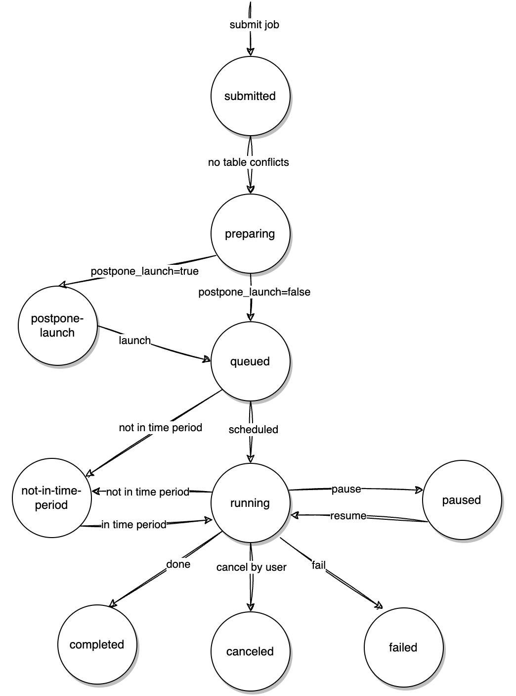

## 适用场景

当您有一个较大的DML需要执行时，若直接执行它，可能会造成内存溢出或者占用了过多计算资源，导致其他SQL的性能受到影响。这时，你可能会想着把这个DML拆分成若干个小的D ML来执行，每个小DML执行之间存在时间间隔，好避免上述问题。你也可能希望某些DML只在一天中的特定时间去执行，好避免业务高峰期。
如果你有上述的需求，那么不妨试试非事务DML。

## 非事务性 DML 简介

### DML 拆分

非事务性 DML 涉及将一个 DML 操作拆分为多个较小的 DML，拆分方法非常简单易懂：

整个非事务性 DML 任务称为**作业（job）**，每个较小的 DML 任务称为**批次（batch）**。每个批次都有一个指定的**批次大小（batchSize）**，表示每个批次的 DML 将影响的最大行数。

在您提交 DML 后，将根据表的主键（PK）对受影响的行进行排序。每**批次大小**行组成一个批次，因此每个批次都有一个 PK 范围条件，这些范围条件将被添加到原始 DML 中，以生成每个批次的 DML SQL。

例如：
```sql  
+----+------+  
| id | age  |  
+----+------+  
|  1 |  15  |  
|  3 |  10  |  
|  6 |  20  |  
|  7 |  45  |  
|  9 |  56  |  
| 10 |  28  |  
| 12 |   2  |  
| 15 |  23  |  
+----+------+  
  
id 是主键，batchSize 为 3  
  
原始 SQL 是：delete from mytable where age >= 10;  
  
然后 wescale 将为该作业创建三个批次，如下所示：  
  
批次 0：delete from mytable where age >= 10 and id >= 1 and id <= 6;  
批次 1：delete from mytable where age >= 10 and id >= 7 and id <= 10;  
批次 2：delete from mytable where age >= 10 and id >= 15 and id <= 15;  
```

如果在批次执行过程中您未对 DML 表进行特定修改，则所有批次 DML 的组合效果等同于原始 DML。

### 非事务性

顾名思义，**非事务性 DML 不保证事务的 ACID 特性**。

例如，如果原始 DML 计划删除 100 条记录，且批次大小为 50。我们将得到两个批次，每个批次删除 50 条记录，这意味着其他事务可能会看到删除的中间结果，从而破坏事务的**隔离性**。

如果在执行第一个批次后失败，已删除的 50 条记录将无法恢复，剩余的 50 条记录仍然存在，从而破坏事务的**原子性**。

总之，非事务性 DML 本质上是**一种分割服务**，帮助您将 DML 拆分成多个批次。

批次执行还由**节流器（throttler）**管理，以防止影响主要 SQL 流量（详见控制部分）。

非事务性 DML 提供了一组命令，供您监控和控制执行过程。但需要注意的是，非事务性 DML 不保证事务属性。

## 使用方法

非事务性 DML 提供了用于提交、监控和控制 DML 作业的命令。

有效使用非事务性 DML 的关键是理解 DML 分割过程，并意识到它不保证事务属性。

因此，在执行非事务性 DML 时，**必须确保您的应用代码不依赖于 DML 的事务属性**。

### 提交

目前，非事务性 DML 支持两种 DML 操作：**更新（update）**和**删除（delete）**。

要提交一个非事务性 DML 作业，只需在原始 DML 中添加一个注释：
```sql  
delete/*vt+ dml_split=true */ from mytable where age >= 10;  
update/*vt+ dml_split=true */ mytable set age = 60 where age >= 10;  
```  

注释 `dml_split=true` 告诉 `wescale` 将此 DML 视为一个非事务性 DML 作业。

在提交时，您还可以选择其他参数：

| 指令                | 描述                                                                                               |  
|--------------------------|-----------------------------------------------------------------------------------------------------------|  
| DML_BATCH_INTERVAL       | 批次执行之间的间隔时间，以毫秒为单位。                                              |  
| DML_BATCH_SIZE           | 每个批次影响的最大行数。                                                                    |  
| DML_POSTPONE_LAUNCH      | 指示是否推迟 DML 作业的执行。                                                  |  
| DML_FAIL_POLICY          | 处理批次失败的策略。详见**失败策略**部分。  |  
| DML_TIME_PERIOD_START    | 指定 DML 执行的最早时间。                                        |  
| DML_TIME_PERIOD_END      | 指定 DML 执行的最晚时间。                                          |  
| DML_TIME_PERIOD_TIME_ZONE | 指定时区。                                            |  

例如：
```sql  
delete /*vt+ dml_split=true dml_batch_interval=1000 dml_batch_size=3 */ from mytable where age>=10;  
```  

该作业每秒执行一次，每个批次最多影响 3 行，并且作业将在提交后立即调度执行。如果某个批次失败，策略是暂停作业。该作业可以在任何时间运行。

提交成功后，您将收到一个作业的 UUID，以及有关批次的信息，包括 `批次信息表名称`、`批次执行间隔`、`批次大小`、`失败策略` 和 `是否推迟调度`。

### 监控

您可以使用以下命令查看所有作业：
```sql  
show dml_jobs \G;  
```  

您还可以检查特定作业的详细信息：
```sql  
show dml_job 'job_uuid' \G;  
```  

添加 `details` 可以查看作业的批次信息表：
```sql  
show dml_job 'job_uuid' details \G;  
```  

作业表具有多个字段，以下是解释：

| 字段                           | 描述                                                                                                                   |  
|---------------------------------|-------------------------------------------------------------------------------------------------------------------------------|  
| job_uuid                        | DML 作业的唯一标识符。                                                                                            |  
| table_schema                    | DML 相关表所在的数据库。                                                                  |  
| table_name                      | DML 相关表的名称。                                                                                        |  
| batch_info_table_schema         | 批次信息表所在的数据库。                                                                              |  
| batch_info_table_name           | 批次信息表的名称。                                                                                                 |  
| status                          | 作业的当前状态。                                                                                                   |  
| status_set_time                 | 状态字段设置的时间。                                                                                          |  
| time_zone                       | 状态设置时间的时区。                                                                                             |  
| message                         | DML 作业控制器在运行时设置的消息。                                                                      |  
| dml_sql                         | 用户提交的 SQL。                                                                                                   |  
| batch_interval_in_ms            | 批次执行之间的间隔时间。                                                                                           |  
| batch_size                      | 每个批次影响的最大行数。                                                                               |  
| fail_policy                     | 批次失败时采取的操作。目前支持跳过、终止和暂停。                                                  |  
| batch_concurrency               | 批次并发性（目前不支持，设置为 1）。                                                                       |  
| affected_rows                   | 作业当前影响的总行数。                                                                         |  
| throttle_ratio                  | 节流比率。                                                                                                            |  
| throttle_expire_time            | 节流的到期时间。                                                                                              |  
| dealing_batch_id                | 当前正在处理的批次 ID。                                                                                            |  
| running_time_period_start       | DML 执行的最早时间。                                                                                             |  
| running_time_period_end         | DML 执行的最晚时间。                                                                                               |  
| running_time_period_time_zone   | DML 执行的时区。                                                                                                 |  


批次信息表具有多个字段，以下是解释：

| 字段                           | 描述                                                                                                                   |  
|---------------------------------|-------------------------------------------------------------------------------------------------------------------------------|  
| batch_id                        | 每个批次的 ID，从 1 开始。如果它带有 "-", 则该批次是通过**自动批次拆分**创建的。                        |  
| batch_status                    | 批次的执行状态。                                                                                                |  
| count_size_when_creating_batch  | 创建批次时估计受影响的行数。                                                                 |  
| actually_affected_rows          | 执行批次时实际受影响的行数。                                                                     |  
| batch_begin                     | 批次 PK 范围内的主键（PK）最小值（如果有多个 PK，则用逗号分隔）。                        |  
| batch_end                       | 批次 PK 范围内的主键（PK）最大值（如果有多个 PK，则用逗号分隔）。                        |  
| batch_sql                       | 批次将执行的 SQL。                                                                                                   |  
| batch_count_sql_when_creating_batch | 在批次执行之前估算受影响行数。  |  

### 调度机制

DML 作业控制器是非事务性 DML 功能的核心组件，它负责维护每个作业所处理或已完成准备的表。

作业状态包括 `submitted`（已提交）、`preparing`（准备中）、`postpone-launch`（推迟启动）、`queued`（排队中）、`not-in-time-period`（不在时间段内）、`running`（运行中）、`paused`（已暂停）、`canceled`（已取消）、`completed`（已完成）和 `failed`（已失败）。

当一个新作业被提交时，它会被设置为 `submitted` 状态。如果它修改的表不在作业控制器维护的表集合中，该作业将被设置为 `preparing` 状态并开始创建批次信息表。

在批次信息表创建完成后，根据 `DML_POSTPONE_LAUNCH` 的值，作业将被设置为 `queued` 或 `postpone-launch` 状态。

如果作业处于排队状态且当前时间在运行时间段内，则它将被设置为 `running` 状态。否则，它将转变为 `not-in-time-period` 状态。

用户可以将正在运行的作业设置为 `paused`（暂停）或 `canceled`（取消）状态。成功完成的运行作业将进入 `completed` 状态。如果执行过程中发生错误，作业将进入 `failed` 状态。

如果两个作业处理不同的表，它们可以并行运行。目前并行运行的作业数量没有限制。

下面是作业状态的转换图。



### 控制

#### 推迟启动

在提交非事务性 DML 时，您可能不希望它立即执行，而是希望在确认一切正常后再调度该作业执行。

在这种情况下，您可以在提交 DML 作业时将 `DML_POSTPONE_LAUNCH` 字段设置为 true：
```sql  
delete /*vt+ dml_split=true dml_postpone_lanch=true */ from mytable where age>=10;  
```  

此作业虽然已提交，但会被推迟调度。想要开始调度该作业时，可以使用以下 SQL：
```sql  
alter dml_job 'job_uuid' launch  
```  

#### 暂停和恢复

当作业处于运行状态时，您可以使用以下 SQL 暂停它：
```sql  
alter dml_job 'job_uuid' pause  
```  

当一个 DML 作业暂停时，它涉及的表仍会保留在作业控制器的数据结构中。这意味着，如果稍后有新 DML 作业尝试修改这些表，它将被阻塞。

想要恢复该作业时，可以使用以下 SQL：
```  
alter dml_job 'job_uuid' resume  
```  

#### 取消

当作业处于运行状态时，您可以使用以下 SQL 提前取消它：
```sql  
alter dml_job 'job_uuid' cancel  
```  

当 DML 作业被取消时，与其相关的所有元数据（如修改的表）将被删除，这与暂停不同。

#### 流控

在执行每个批次之前，会向 `wescale 节流器`发送请求。如果节流器判断 `wescale 集群`的流量负载较高，批次执行将暂时延迟，直到集群的流量负载降低。

当然，您还可以手动指定每个批次的节流概率和生效时间。

**在作业提交时**：
```  
delete /*vt+ dml_split=true dml_throttle_ratio=number dml_throttle_duration=duration   */ from mytable where age>=10  
```  

例如：
```sql  
delete /*vt+ dml_split=true dml_throttle_ratio=1 dml_throttle_duration=30m   */ from mytable where age>=10  
```  

这将完全节流该作业三十分钟。如果未指定比例或持续时间，则比例为 0，持续时间为空。如果仅指定比例，默认持续时间为 100*365*24 小时。如果仅指定持续时间，默认比例为 1。

**在作业执行过程中**：
```sql  
alter dml_job 'job_uuid' throttle expire 'duration' ratio number   
```  

例如：
```sql  
alter dml_job 'job_uuid' throttle expire '30m' ratio 0.9  
```  

这意味着在接下来的三十分钟内，每个批次执行时有 90% 的概率被延迟。

想要取消批次的节流概率和时间时，可以使用以下 SQL：
```sql  
alter dml_job 'job_uuid' unthrottle  
```  

#### 执行时间控制

当您希望作业仅在特定时间段内执行时，可以为该作业设置一个时间段：

在作业提交时：
```sql  
delete /*vt+ dml_split=true dml_time_period_start=18:00:00 dml_time_period_end=19:00:00 dml_time_period_time_zone=UTC+08:00:00 */ from mytable where age>=10;  
```  

这指定作业应仅在每天的 `18:00:00` 到 `19:00:00` 之间运行，时区为 `UTC+08:00:00`（如果未指定，默认使用系统默认时区）。

在作业执行过程中：
```sql  
alter dml_job 'job_uuid' time_period 'start_time' 'end_time' 'time_zone'  
  
alter dml_job 'job_uuid' time_period '18:00:00' '19:00:00' 'UTC+08:00:00'  
```  

当结束时间早于开始时间时，结束时间会增加一天，例如：
```sql  
alter dml_job 'job_uuid' time_period '23:00:00' '06:00:00'  
```  

这意味着作业将从晚上 11 点运行到第二天早上 6 点。

#### 失败策略

当批次执行失败时，有几种策略可供选择：跳过、终止和暂停。
- **跳过**：跳过当前批次（如果失败），并继续执行下一个批次。
- **终止**：如果当前批次失败，则将整个作业标记为失败。
- **暂停**：如果当前批次失败，则将整个作业标记为暂停。

您可以在提交作业时指定失败策略，默认情况下是暂停：
```sql  
delete /*vt+ dml_split=true dml_fail_policy=pause */ from mytable where age>=10;   
```  

上述 SQL 在提交作业时将失败策略设置为暂停。在这种情况下，如果某个批次失败，作业将被暂停。此时，您可以检查作业表中的消息字段，尝试修复错误，并使用恢复命令继续作业。

此外，当失败策略设置为跳过时，如果某个批次因失败而被跳过，其状态将被设置为跳过，并附带错误消息。

## 运行时的batch拆分

在每个批次创建时，`count_size_when_creating_batch` 字段记录批次将影响的估计行数。对于作业提交期间创建的批次，该字段的值等于批次大小。

在执行每个特定批次之前，将使用 `select count` 语句获取批次将影响的行数 *N*。如果 *N* 大于批次大小，则批次将自动拆分。前 **批次大小** 的行分配给**当前批次**，剩余的 *N-批次大小* 行分配给**新批次**。

自动生成的新批次的批次 ID 特殊，并包含 "-".

如果由批次 ID "x" 创建一个新批次，新批次的 ID 将为 "x-2"。如果由批次 ID "x-y" 创建一个新批次，新批次的 ID 将为 "x-y+1"。

自动拆分机制确保每个批次的大小不超过批次大小，避免由于批次大小意外增加而导致的潜在内存不足问题。

自动拆分由 `wescale` 自动执行，不需要人工干预。