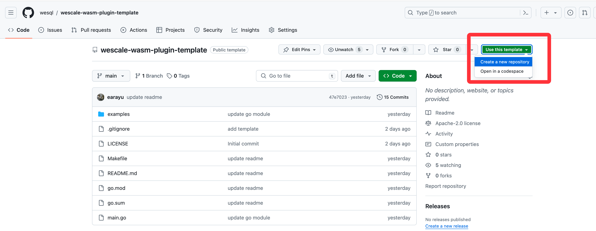
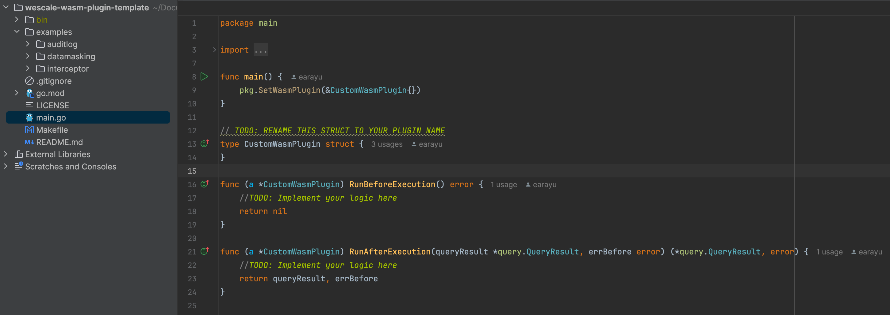

# 介绍

大多数平台软件都提供了一定程度的可扩展性。就像 MySQL 允许用户编写 UDF（用户定义函数）来扩展功能一样，WeScale 也允许用户编写 filter 来实现类似的目的。然而，对于大多数用户来说，这仍然不是一个非常友好的方式，因为这需要他们将自己的代码与服务提供商提供的代码一起编译和分发。

更好的方式是：现代浏览器提供了扩展性，允许希望进行深度定制的用户编写浏览器扩展，而那些只需要浅层定制的用户可以使用类似 Tampermonkey 的插件来注入 JavaScript 代码以改变浏览器的行为。

因此，基于 filter，WeScale 提出了 Wasm 插件（Wasm Plugin）的概念。我们希望 Wasm 插件能够为用户提供更安全、动态且易于使用的扩展性。

在开始之前，我建议您阅读 [设计文档](..%2Fdesign%2F20240531_WasmPlugin.md) 来了解 Wasm 插件的设计。

# 克隆 WeScale-Wasm-Plugin-Template

我们为您准备了一个模板，用来编写您的 Wasm 插件。您可以从 [WeScale-Wasm-Plugin-Template](https://github.com/wesql/wescale-wasm-plugin-template) 克隆模板，并按照 README.md 中的说明编写您的 Wasm 插件。


# 编写您的代码

模板的结构非常简单，您可以直接在 `main.go` 文件中编写代码。您可以在 `examples` 目录中查看示例代码。还有一个 `Makefile` 帮助您构建和部署 Wasm 二进制文件。


假设您想编写一个 Wasm 插件，用来拦截没有 WHERE 子句的 DML 查询。

第一步是从主机环境获取查询。您可以使用 `hostfunction.GetHostQuery` 函数获取查询。主机环境提供的所有函数都定义在 `host_functions` 包中。
```go
func (a *CustomWasmPlugin) RunBeforeExecution() error {
	query, err := hostfunction.GetHostQuery()
	if err != nil {
		return err
	}

	return nil
}
```

接下来，您需要识别该查询是否为 DML 查询，并检查它是否包含 WHERE 子句。如果没有 WHERE 子句，您可以返回一个错误。幸运的是，您可以导入第三方库来解析 SQL 查询并检查它是否符合要求。现在代码如下：
```go
import (
    "fmt"
    "github.com/wesql/wescale-wasm-plugin-sdk/pkg"
    hostfunction "github.com/wesql/wescale-wasm-plugin-sdk/pkg/host_functions/v1alpha1"
    "github.com/wesql/wescale-wasm-plugin-sdk/pkg/proto/query"
    "github.com/xwb1989/sqlparser"
)

func (a *CustomWasmPlugin) RunBeforeExecution() error {
	query, err := hostfunction.GetHostQuery()
	if err != nil {
		return err
	}

	stmt, err := sqlparser.Parse(query)
	if err != nil {
		hostfunction.InfoLog("parse error: " + err.Error())
		return nil
	}
	switch stmt := stmt.(type) {
	case *sqlparser.Update:
		if stmt.Where == nil {
			return fmt.Errorf("没有 WHERE 子句")
		}
	case *sqlparser.Delete:
		if stmt.Where == nil {
			return fmt.Errorf("没有 WHERE 子句")
		}
	default:
	}

	return nil
}
```

在 `RunAfterExecution` 函数中，我们没有需要做的事情，所以可以将其留空。

```go
func (a *CustomWasmPlugin) RunAfterExecution(queryResult *query.QueryResult, errBefore error) (*query.QueryResult, error) {
	return queryResult, errBefore
}
```

就这样！您已经编写了一个用于拦截没有 WHERE 子句的 DML 查询的 Wasm 插件。您可以在 `examples/interceptor` 目录中找到完整的代码。

# 编译和部署

您可以在模板仓库的 `README.md` 中找到编译和部署 Wasm 插件的详细步骤。以下是一个简短的总结：

1. 运行 `make build` 命令构建 Wasm 二进制文件。
```bash
make build WASM_FILE=my_plugin.wasm
```

2. 通过运行 `wescale_wasm` 二进制文件来部署 Wasm 插件。
```bash
# 安装 wescale_wasm 二进制文件，它将帮助您部署插件
make install-wescale-wasm

# 部署插件
./bin/wescale_wasm --command=install --wasm_file=./bin/my_plugin.wasm --mysql_host=127.0.0.1 --mysql_port=15306 --mysql_user=root --mysql_password=root
```

3. 检查插件的状态。
```bash
$ mysql -h127.0.0.1 -P15306 -e 'show filters\G'
*************************** 1. row ***************************
                         id: 47
           create_timestamp: 2024-05-31 18:27:50
           update_timestamp: 2024-05-31 18:27:50
                       name: my_plugin_wasm_filter
                description:
                   priority: 1000
                     status: ACTIVE
                      plans: ["Select","Insert","Update","Delete"]
fully_qualified_table_names: []
                query_regex:
             query_template:
           request_ip_regex:
                 user_regex:
      leading_comment_regex:
     trailing_comment_regex:
             bind_var_conds:
                     action: WASM_PLUGIN
                action_args: wasm_binary_name="my_plugin.wasm"
```

4. 现在您可以运行一些带有或不带 WHERE 子句的 DML 查询来测试插件。
```go
$ mysql -h127.0.0.1 -P15306 -e '/*explain filter*/delete from mysql.user'
+-----------------------+-------------+----------+-------------+-----------------------------------+
| Name                  | description | priority | action      | action_args                       |
+-----------------------+-------------+----------+-------------+-----------------------------------+
| my_plugin_wasm_filter |             | 1000     | WASM_PLUGIN | wasm_binary_name="my_plugin.wasm" |
+-----------------------+-------------+----------+-------------+-----------------------------------+

$ mysql -h127.0.0.1 -P15306 -e 'delete from mysql.user'
ERROR 1105 (HY000) at line 1: target: .0.primary: vttablet: rpc error: code = Unknown desc = error from wasm plugin at after execution stage: error from wasm plugin at before execution stage: no where clause (CallerID: userData1)
```

5. 如果您想移除插件，可以运行以下命令。
```bash
./bin/wescale_wasm --command=uninstall --filter_name=my_plugin_wasm_filter
```