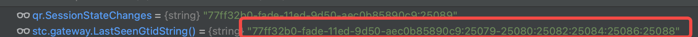

# 20230609_CompressGtidSets

- Feature: CompressGtidSets
- Status: in-progress
- Start Date: 2023-06-09
- Authors: @gerayking
- RFC PR: https://github.com/apecloud/wesql-scale/pull/103
- WeSQL-Scale Issue: https://github.com/apecloud/wesql-scale/issues/37

# BackGround

For further related information, please refer to [20230414_ReadAfterWrite](https://github.com/apecloud/wesql-scale/blob/vitess-release-16.0-dev/doc/design-docs/RFCS/20230414_ReadAfterWrite.md)

## Why is gtidSets disconnected?

In the context of wesql-scale, there are two levels of Read After Write (RAW), namely instance and session levels. Currently, the session-level gtid is stored as the latest gtid, while the instance-level solution involves maintaining a gtidSets in the memory of vtgate and incorporating it into the SQL to be executed, such as `select`. This article focuses only on the instance-level solution. When multiple vtgates are in play, for instance, vtgate1 and vtgate2, and SQL is cross-accessing these vtgates, numerous internal fragmentations will occur in the gtidSet maintained by vtgate1 and vtgate2. The following images depict a scenario involving 2 vtgates.


vtgate1:

vtgate2:


## Why need Compress GtidSets?

For the relevant issue, please refer to [#37](https://github.com/apecloud/wesql-scale/issues/37)

## Summary

The proposed change aims to compress the Gtid set to prevent SQL commands from becoming excessively lengthy.

# Technical design

## Design Details

Each VTGate is responsible for maintaining the gtidset, which represents its up-to-date understanding of the existing gtids for that specific instance of VTGate. During execution stage, the VTGate need to use the gtidset to ensure read-after-write-consistency.

To compress the GTID set, we need to acquire the GTID set from each MySQL instance and merge it with the gtidset maintained within vtgate.

### Step 1: Get GTID set from tablet 

Within tablet_health_check, vtgate sends a heartbeat packet to vttablet. The response from the heartbeat packet carries the gtidset of the current vttablet and its corresponding MySQL instance. Hence, the Gtid set of each tablet can be derived from the response.

### Step 2: Compress GtisSet with lastseengtid

+ Get the intersection of all mysql GTID sets.
    Example:
    ```yaml
    tablet1 : 1~6,8~10,11~15
    tablet2 : 2~7,9~12,13~16
    tablet3 : 2~5,7~13,14~17
     
    inttersectionSet: 2~5,9~10,14~15
    ```
+ Merge intersectionSet and lastSeenGtid.
    The lastSeenGtid refers to the gtid sets maintained by vtagte. In this section, we utilize the mysql56GtidSet.Union function for implementation.
    + First we cut off the part larger than lastSeenGtid in inttersectionSet.
    Example:
        ```yaml
        inttersectionSet: 2~5,9~13
        lastSeenGtid: 1~11

        result: 2~5:9~11
        ```
    + Then, calculate the union of lastSeenGtid andthe remaining portion after truncation.
### When we need CompressGtidSet?

We made some tradeoffs and finally decided to perform compression after the return of the heartbeat packet. Moreover, there is an optimization that triggers compression when the length of the gtidset exceeds a certain threshold.

### Conclusion

After the return of the heartbeat packet, we compress the gtidset within the vtgate. In a scenario with multiple vtgates, we ensured read-after-write (RAW) consistency and prevented the SQL statement from becoming too lengthy. However, the mechanism is still reliant on the return of the heartbeat packet from all MySQL instances.

# Future Works

Given that the current mechanism still depends on the return of the heartbeat packet, it will be necessary to actively monitor the length of the gtidset and proactively synchronize the gtidset of each MySQL instance in the future.

# Reference

- 20230414_ReadAfterWrite: [https://github.com/apecloud/wesql-scale/blob/vitess-release-16.0-dev/doc/design-docs/RFCS/20230414_ReadAfterWrite.md](https://github.com/apecloud/wesql-scale/blob/vitess-release-16.0-dev/doc/design-docs/RFCS/20230414_ReadAfterWrite.md)