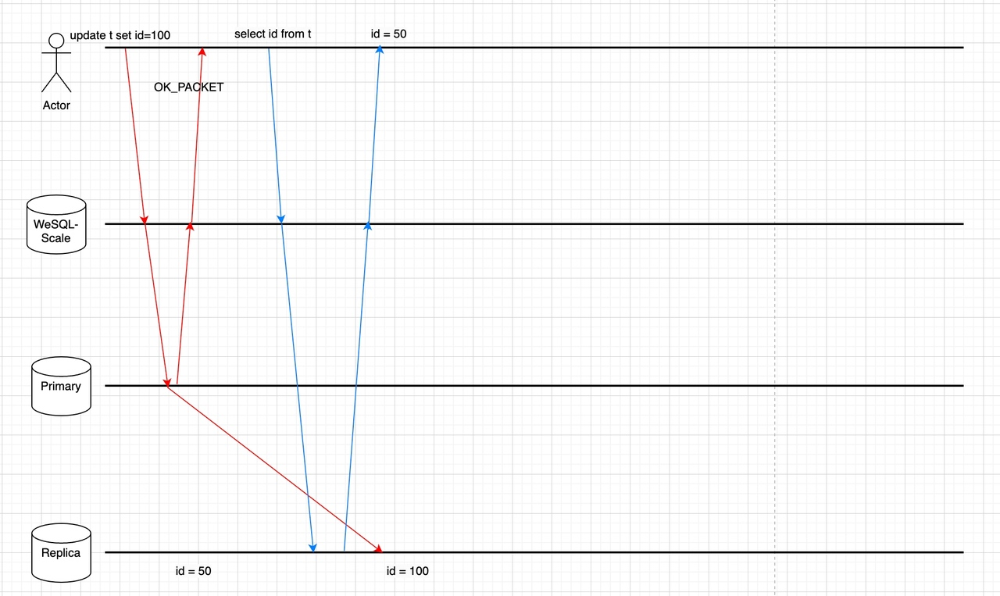
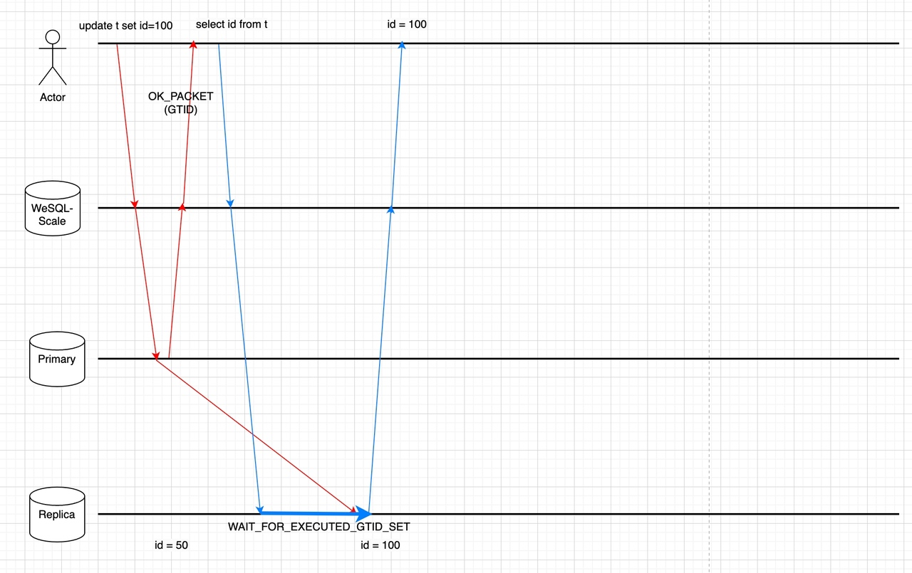

# Introduction
The need for read-only nodes in MySQL arises from the increasing demand for high availability and scalability in modern applications. As the number of users and data volume grows, it becomes essential to distribute the workload across multiple nodes to ensure optimal performance. Read-write splitting is a technique that helps achieve this goal by directing read queries to read-only nodes and write queries to read-write nodes, thereby reducing the load on the primary node and improving overall performance.

WeSQL WeScale is a database proxy designed to be highly compatible with MySQL. It supports the MySQL wire protocol, read-write splitting without stale reads, connection pooling, and transparent failover. In this article, we will explain the design considerations and provide detailed techniques for read-write-splitting in WeSQL WeScale.
# Read-Write-Splitting
After adding a read-only node, users are often provided an endpoint for read-only operations. Users need to modify the application configuration or code to determine whether to utilize the original read-write endpoint or the newly acquired read-only endpoint. Some proxies offer users the ability to create read-write-splitting rules using regular expressions. However, this approach can be quite complex and hard to handle efficiently.

Our implementation of read-write splitting involves parsing SQL queries and using the Abstract Syntax Tree (AST) to determine where to route the queries. By analyzing the user's SQL, we can identify whether it is a read-only query statement, a Data Manipulation Language (DML) statement, or a special statement that needs to be executed on the primary node, such as SELECT LAST_INSERT_ID(). If it is a read-only query statement, we route it to the read-only node; otherwise, it is sent to the read-write node.

This approach eliminates the need for users to configure anything or make any application code changes.
# ReadAfterWrite Consistency
In a replicated MySQL cluster, the follower always takes some time to sync the data from the leader. Therefore, a read operation may be forwarded to a lagging follower and not receive the data that was just written by the same client. The Read-Write-Splitting feature has exacerbated this phenomenon, as it automatically sends read operations to followers.

The Picture below shows why the read operation is unable to get the latest data.

Some proxies track replication lag and disable the use of read slaves if the lag becomes too high, but they are not intelligent enough to determine when it is safe for a specific query to be routed to the read-slave.
Our solution, WeSQL WeScale, guarantees ReadAfterWrite Data Consistency by tracking Global Transaction Identifiers (GTIDs) between primary and follower nodes.

When GTID is enabled, every transaction (including autocommit) will be assigned a GTID after it is successfully committed. The GTID serves as the watermark for the current operation. The follower MySQL instance will subsequently apply the transaction and mark the  GTID executed. At this point, we can determine that it’s safe to read the data on the follower node.
## Technique Details
WeSQL WeScale facilitates the following steps to ensure the freshness of the data, while attempting to avoid introducing additional round-trip (RT) time to guarantee performance:

**Step 1: Get GTID after write operation without extra network round**
Starting from MySQL 5.7, the MySQL protocol implements a mechanism (SESSION_TRACK_GTIDS) to collect the GTIDs to be sent over the wire in the response packet. This feature assists us in acquiring GTIDs without introducing further network rounds after write operations.

**Step 2: Store the GTID in WeSQL WeScale sessions**
After parsing the response packet and getting the GTIDs, WeSQL WeScale will store them in memory.
Depends on the consistency level, the GTIDs may be stored in the client’s Session or a global memory data structure.
Later read operations will utilize GTIDs stored in WeSQL WeScale’s memory, to ensure retrieval of data that was previously written. See below steps for more details.

**Step 3: Select a follower for reading**
A memory data structure called CLUSTER_GTID_EXEUTED is also matained in WeSQL WeScale’s memory, it contains the @@global.gtid_executedvalues of every follower MySQL instance. The CLUSTER_GTID_EXEUTED is updated periodically by the health-check module, but it will inevitably be lagging.
During the routing phase of a read operation, WeSQL WeScale will use the GTIDSet (which we got from step2) to pick a MySQL instance based on CLUSTER_GTID_EXEUTED.
If there is a MySQL instance that has a more up-to-date GTIDSet than the GTIDSet requested by the read operation, we can send the read operation directly to the MySQL instance and ensure that it will read the data we just wrote.

**Step 4: Ensure write operations have been propagated to the follower MySQL**
All the follower MySQL instances may be lagging, or the CLUSTER_GTID_EXEUTED may be out-of-date for whatever reason. It is possible that no follower is available for a read operation in Step 3.
We can either send the read operation to the leader, or send the read operation to the follower with a WAIT_FOR_EXECUTED_GTID_SET prefix. WAIT_FOR_EXECUTED_GTID_SET function will keep waiting until a GTID is executed on the follower or until times out.

We can use multi-statements to save one network round:
```SQL
-- for example, if user's SQL is: 
select * from t1;

-- the actual SQL sent to follower may be a multi-statement like this:
select WAIT_FOR_EXECUTED_GTID_SET('ab73d556-cd43-11ed-9608-6967c6ac0b32:7', 3);select * from t1;
```
We need to handle the MySQL protocol carefully to use the multi-statement, otherwise the MySQL connection may be broken.

All the steps above will not introduce additional network rounds. The Picture below shows why the Read-After-Write feature ensures the read operation is able to get the latest data.


# Load Balancing
When multiple read-only nodes are available, we need to determine which node should execute user's SQL queries. Different business scenarios require different Load Balance policies. For example, sometimes the application wants to distribute the workload to improve resource utilization. Other times, the application wants to minimize the response time to enhance user experience.
WeSQL WeScale implements different Load Balance policies to give the users the power of choice. Our load balancing policies include:
- **LEAST_QPS**: Load balance queries across read nodes with the lowest query per second.
- **LEAST_RT**: Load balance queries across read nodes with the lowest response time.
- **LEAST_BEHIND_PRIMARY**: Load balance queries across read nodes with the least lag behind the primary node.
- **RANDOM**: Randomly load balance queries across available read nodes.

WeSQL WeScale will maintain health checks with all MySQL nodes. So, with the failover event of a node, WeSQL WeScale is capable of detecting the failed node automatically and routing requests to a healthy node. Once the node has recovered, WeSQL WeScale will mark it as available and sending requests to it. This entire process does not require any human intervention or application configuration changes. This feature ensures smooth operation and minimal downtime during failover situations.
# Conclusion
People usually add read-only nodes for high availability and scalability, but if the newly added read-only nodes come with an additional endpoint, it can bring a lot of additional complexity to developers and applications. For example, how applications can use two endpoints to achieve read-write split and handle the additional readAfterWrite Consistency and Load balance issues that arise after splitting read/write traffic.
This article explains the design considerations of WeSQL WeScale for these problems, as well as how WeSQL WeScale takes care of all these problems and does not require complex configuration and code changes.