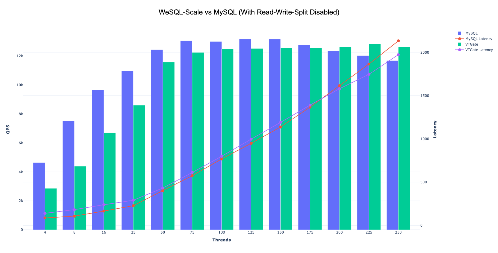
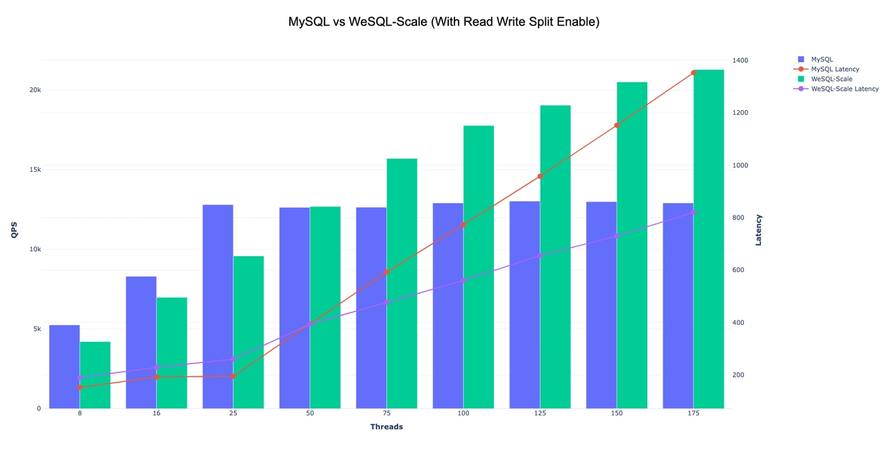
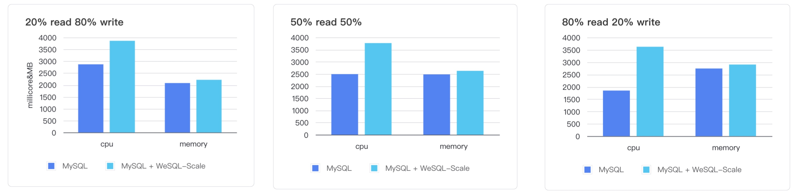

# Performance Comparison: WeSQL-Scale vs MySQL

# Introduction

WeSQL-Scale is a database proxy that is compatible with MySQL. It supports read-write splitting without stale reads, connection pooling, and transparent failover. These features work together to improve application scalability, performance, security, and resilience. In this article, we will compare the performance of WeSQL-Scale and MySQL, and examine how these features affect throughput and latency. Let's get started!

For those in a hurry, here are the main findings:

- Adding WeSQL-Scale as a proxy for MySQL may cause some additional network round trips, but despite this, its overall throughput and latency under high load conditions are similar to a direct connection.
- When the read-write-split feature is activated, WeSQL-Scale demonstrates linear throughput growth even after MySQL reaches its bottleneck, as the number of pressure testing threads gradually increases.
- The resource overhead introduced by WeSQL-Scale accounts for only about 1/3 of the total resource consumption. The cost-effectiveness of increasing QPS through read-write-splitting and horizontal scaling with WeSQL-Scale is higher compared to the cost-effectiveness of vertical scaling with MySQL.

# Benchmarking WeSQL-Scale and MySQL

## Environment

> kubernetes version：1.26.3
> 
> 
> Load balancer: slb.s2.small
> 
> Machine: 4C16G
> 
> SysBench: balanced read write workload
> 

We have deployed a WeSQL-Scale cluster in Kubernetes. SysBench can connect to both VTGate and MySQL directly, allowing us to compare their performance. The MySQL cluster consists of one Leader and two Followers. VTTablet is deployed as a sidecar in the MySQL Pod. VTGate and SysBench are deployed in their respective Pods. Each Pod will have exclusive access to a 4-core 16GB cloud server.

## MySQL vs WeSQL-Scale (With Read Write Split Disabled)

| Threads | MySQL QPS | MySQL AvgLatency | MySQL PctLatency | WeSQL-Scale QPS | WeSQL-Scale AvgLatency | WeSQL-Scale PctLatency |
| --- | --- | --- | --- | --- | --- | --- |
| 4 | 4638.01 | 86.2 | 123.28 | 2858.98 | 139.77 | 161.51 |
| 8 | 7508.5 | 106.48 | 142.39 | 4386.4 | 182.21 | 223.34 |
| 16 | 9654.44 | 165.67 | 211.6 | 6698.62 | 238.58 | 282.25 |
| 25 | 10968.65 | 227.77 | 287.38 | 8596.97 | 290.47 | 350.33 |
| 50 | 12440.1 | 401.39 | 530.08 | 11576.21 | 431.36 | 549.52 |
| 75 | 13055.7 | 573.76 | 746.32 | 12242.44 | 611.36 | 816.63 |
| 100 | 12998.67 | 767.69 | 1013.6 | 12488.25 | 798.48 | 1170.65 |
| 125 | 13170.12 | 947.78 | 1304.21 | 12514.46 | 996.2 | 1427.08 |
| 150 | 13167.33 | 1136.95 | 1533.66 | 12553.09 | 1190.45 | 1618.78 |
| 175 | 12772.8 | 1366.46 | 1836.24 | 12551.4 | 1389.39 | 1869.6 |
| 200 | 12351.89 | 1614.56 | 2320.55 | 12630.16 | 1579.17 | 2120.76 |
| 225 | 12024.3 | 1864.79 | 2728.81 | 12843.0 | 1745.59 | 2405.65 |
| 250 | 11686.86 | 2132.42 | 3511.19 | 12612.59 | 1972.6 | 2680.11 |

Some Observations:

- When the sysbench thread count is low, WeSQL-Scale's throughput is about one-third lower than when directly connecting to MySQL, and its latency is also higher. However, as the thread count increases, the performance and throughput of WeSQL-Scale begin to approach those of a direct MySQL connection.
- By utilizing a connection pool and reusing its connections, the performance overhead brought about by incorporating WeSQL-Scale is effectively concealed.

During the testing process, we found that MySQL couldn't handle too many sysbench threads due to the limitation of max_connection. We had to modify the max_connection parameter in order to test with 175 sysbench threads. However, with max_connections set to 100 in MySQL, WeSQL-Scale can handle over 5000 sysbench threads (we are unable to increase the number of sysbench threads further due to memory constraints on the server).

The above test proves a point: introducing WeSQL-Scale as a proxy can increase the scalability and resilience of the database. It will not compromise much of the performance, including QPS and Latency.

## MySQL vs WeSQL-Scale ( With Read Write Split Enable)

| Threads | MySQL QPS | MySQL AvgLatency | MySQL PctLatency | WeSQL-Scale QPS | WeSQL-Scale AvgLatency | WeSQL-Scale PctLatency |
| --- | --- | --- | --- | --- | --- | --- |
| 8 | 5252.91 | 152.18 | 215.44 | 4202.61 | 190.12 | 219.36 |
| 16 | 8303.15 | 192.53 | 253.35 | 6983.17 | 228.97 | 267.41 |
| 25 | 12807.06 | 195.02 | 272.27 | 9583.73 | 260.51 | 303.33 |
| 50 | 12631.39 | 395.28 | 539.71 | 12689.05 | 393.76 | 484.44 |
| 75 | 12642.1 | 592.75 | 861.95 | 15703.01 | 476.59 | 569.67 |
| 100 | 12907.98 | 773.19 | 1089.3 | 17772.62 | 560.7 | 682.06 |
| 125 | 13028 | 957.99 | 1352.03 | 19049.49 | 655.37 | 877.61 |
| 150 | 12994.45 | 1152.22 | 1618.78 | 20509.19 | 729.86 | 960.3 |
| 175 | 12910.42 | 1352.38 | 1973.38 | 21289.84 | 820.12 | 1149.76 |

Some Observations:

- When WeSQL-Scale enables Read-Write-Split, the QPS of the leader node is higher compared to when Read-Write-Split is not enabled. This is because a portion of the Read traffic is being routed to the follower node.
- As the number of Sysbench threads continues to increase, MySQL's QPS will reach a bottleneck and cannot continue to grow, but due to contention, latency will continue to increase. However, WeSQL-Scale's QPS can continue to grow, while latency is lower than MySQL.

The above test proves a point: by introducing WeSQL-Scale as a proxy, it can scale horizontally and make use of follower node resources, resulting in improved read and write performance of the cluster.

## MySQL vs WeSQL-Scale (CPU and Memory)

|  | MySQL | MySQL + WeSQL-Scale | MySQL | MySQL + WeSQL-Scale | MySQL | MySQL + WeSQL-Scale |
| --- | --- | --- | --- | --- | --- | --- |
| cpu | 2757.50 | 4225.23 | 2430.56 | 4311.56 | 1698.79 | 4211.20 |
| memory | 3123.83 | 3307.30 | 3389.56 | 3591.16 | 3572.50 | 3774.33 |

Some Observations:

- In all workload scenarios, the overall memory resource usage of the cluster is similar to MySQL, which demonstrates that wesql-scale only requires a minimal amount of memory.
- At 50% of the read traffic, the CPU resources occupied by the WeSQL-Scale process are equivalent to 1/3 of the total CPU resources.
- In the case of 80% of the read traffic, the CPU resources occupied by the WeSQL-Scale process exceeded half of the total CPU resources, but it also caused the overall QPS to reach double of the original value. This proves that the cost-effectiveness of increasing QPS through read-write-splitting and horizontal scaling with WeSQL-Scale is higher compared to the cost-effectiveness of vertical scaling with MySQL.

# Conclusion

In conclusion, introducing WeSQL-Scale as a proxy can significantly improve the scalability, performance, security, and resilience of a MySQL database. With read-write splitting enabled, WeSQL-Scale can utilize follower node resources, resulting in improved read and write performance of the cluster.

Furthermore, the overhead introduced by WeSQL-Scale is minimal, and its cost-effectiveness for increasing QPS through read-write-splitting and horizontal scaling is higher compared to the cost-effectiveness of vertical scaling with MySQL.