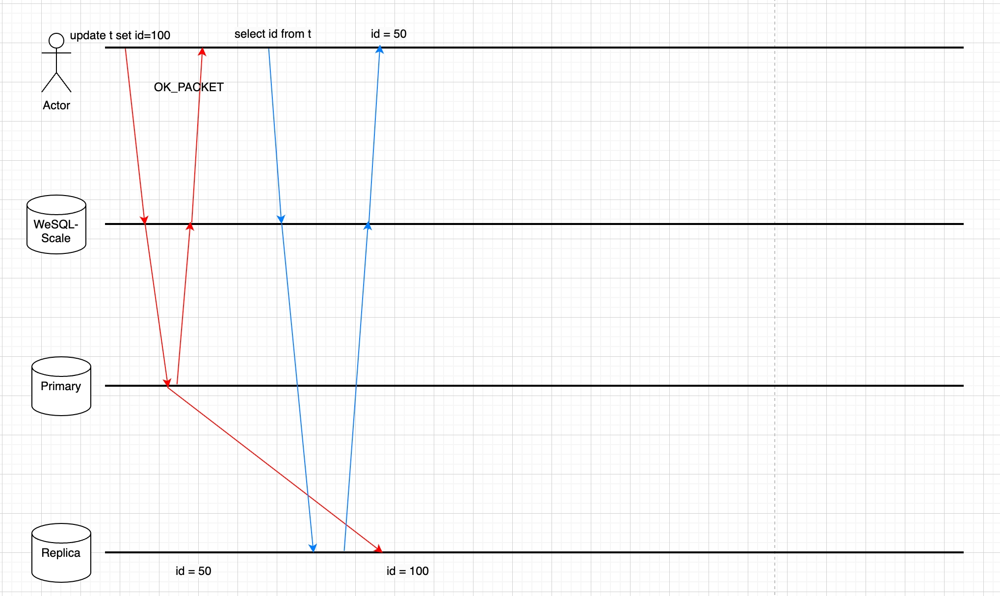
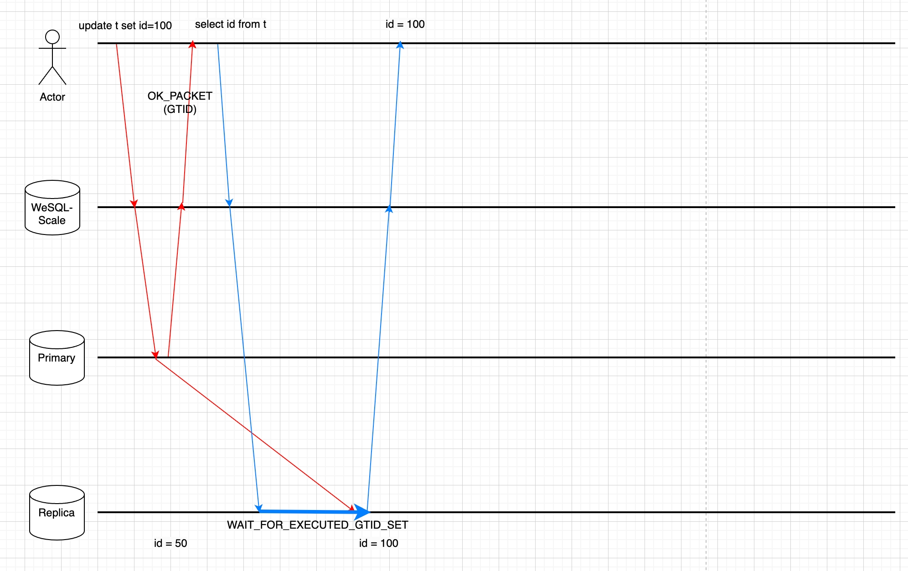

# 20230414_ReadAfterWrite

- Feature: ReadAfterWrite
- Start Date: 2023-04-14
- Authors: @earayu
- RFC PR: https://github.com/apecloud/WeSQL WeScale/pull/23
- WeSQL WeScale Issue: https://github.com/apecloud/WeSQL WeScale/issues/20

# Summary

The proposed change is to add the ReadAfterWrite feature to WeSQL WeScale.

The ReadAfterWrite feature will ensure read operations to retrieve the data that was just written. This will result in a better user experience for clients and improved efficiency for developers.

# Motivation

In a replicated MySQL cluster, the follower always takes some time to replay the binlog from the leader. Therefore, a read request may be forwarded to a lagging follower and not receive the data that was just written by the same client. The ReadWriteSplitting feature has exacerbated this phenomenon, as it automatically sends read requests to followers.

The ReadAfterWrite feature is being proposed to address the issue of read requests being forwarded to lagging followers in a replicated MySQL cluster, which can result in the client not receiving the data that was just written.

This feature would support use cases where read requests need to be performed immediately after write requests, such as in high-traffic applications or when dealing with time-sensitive data.

The Picture below shows why the read request is not able to get the latest data.


# Technical design

## Goals

1. Session Level ReadAfterWrite: Ensure read requests get latest write in the same client connection.
2. Instance Level ReadAfterWrite: Ensure read requests get latest write in the WeSQL WeScale Instance.

## Non-Goals

1. Cross-WeSQL WeScale Instance ReadAfterWrite is not supported as we would need to store the Global Transactions Identifiers (GTIDs) in a linearizably consistent storage, which is slow.
    1. One alternative is for users to manually pass GTIDs between client connections.
2. ReadAfterWrite does not mean 'casual read’ or ‘monitonic read’. Its guarantee is that when a read request is made, it will always return what has been written rather than what has been previously read.
    1. Monotonic read might be supported in a later version.

## Design Details

If GTID is enabled, every transaction (including autocommit) will be given a GTID after it has been successfully committed.

The follower MySQL instance will later apply the transaction and mark the GTID executed.

The ReadAfterWrite feature facilitates the following steps to ensure the freshness of the data:

### Step 1: Get GTID after write operation without extra network round

Starting from MySQL 5.7, the MySQL protocol implements a mechanism to collect the GTIDs to be sent over the wire in the response packet. This feature assists us in acquiring GTIDs without introducing further network rounds.

To enable the feature:

- Client needs to set Capability flag `CLIENT_SESSION_TRACK` when connecting to MySQL via mysql protocol. This will enable MySQL to send the tracking information back to the client.
- Client also needs to issue `SET @@SESSION_TRACK_GTIDS = 'OWN_GTID'` to indicate MySQL to return GTID in the OK packet. This system variable tracks the last DML and DDL commit GTID.

### Step 2: Store the GTID in WeSQL WeScale sessions

After parsing the response packet and get the GTIDs, WeSQL WeScale will store them in the memory.

Depends on the consistency level, the GTIDs may be stored in the client’s Session or a global memory data structure.

Later read operations will utilize GTIDs stored in WeSQL WeScale’s memory, to ensure retrieval of data that was previously written. See belowing steps for more details.

### Step 3: Select a MySQL follower for reading

A `CLUSTER_GTID_EXEUTED` memory data structure is matained in WeSQL WeScale’s memory, it contains’s all the `@@global.gtid_executed`  values from the cluster. The `CLUSTER_GTID_EXEUTED` is updated by the health-check module periodically, and obviously it will be lagging.

Therefore, GTIDs from step1 will update `CLUSTER_GTID_EXEUTED` constantly.

During routing phase of a read operation, it will use the GTID (from session or global memory data structure) to pick a MySQL instance based on `CLUSTER_GTID_EXEUTED`.

As long as the picked MySQL instance containes the read operation’s GTID, the read operation can be directly forwarded to the MySQL instance.

### Step 4: Ensure write requests have been propagated to the follower MySQL

All the follower MySQL instances may be lagging, or the `CLUSTER_GTID_EXEUTED` may be out-of-date for whatever reasons. It is possible that no follower (expect leader, it always holds all the data) is available for a read operation in Step 3.

We can either send the read operation to the leader, or send the read operation to the follower with a `WAIT_FOR_EXECUTED_GTID_SET` prefix. `WAIT_FOR_EXECUTED_GTID_SET` function will keep waiting until a GTID is executed on the follower or until times out.

We can use multi-statement to save one network round:

```jsx
-- for example, if user's SQL is: select * from t1;

-- the actual SQL sent to follower may be a multi-statement like this:
select WAIT_FOR_EXECUTED_GTID_SET('ab73d556-cd43-11ed-9608-6967c6ac0b32:7', 3);select * from t1;
```

We need to handle the mysql protocol carefully to use the multi-statement, otherwise the mysql connection may be broken.

### Conclusion

All the Steps above will not introduce additional network rounds, so the performance is guaranteed.

The users need to enable GTID to enable the feature.

The Picture below shows why the ReadAfterWrite feature ensures the read request is able to get the latest data.


## Road Map

- [x] implement Session Level ReadAfterWrite (Step 1、2、4)

- [x] implement Instance Level ReadAfterWrite (Complement of Step 2、4)

- [x] implement CLUSTER_GTID_EXEUTED data structure (Step 3)

## Usage

### Enable ReadAfterWrite

users can enable the feature by setting a system variable:
```MySQL
set @@read_after_write_consistency='EVENTUAL'; -- default
set @@read_after_write_consistency='SESSION';
set @@read_after_write_consistency='INSTANCE';
```

users can set the timeout for the `WAIT_FOR_EXECUTED_GTID_SET` function:
```MySQL
set @@read_after_write_timeout = 30; -- default 30s
set @@read_after_write_timeout = 0.1; -- 100ms
set @@read_after_write_timeout = 0; -- won't timeout wait forever
```

# Future Works

Monotonic read may be supported in the future. Monotonic read means a user will get more and more updated data. Suppose a user connects to WeSQL WeScale and runs 2 read operations which are identical. If the ReadWriteSplitting feature is enabled, the second read operation may be executed on a MySQL node that has applied lesser GTIDs compared to the first one. As a consequence, the second read returns stale data in comparison to the first one.

# References

- ProxySQL’s Solution: [https://proxysql.com/blog/proxysql-gtid-causal-reads/](https://proxysql.com/blog/proxysql-gtid-causal-reads/)
- MaxScale’s Solution: [https://mariadb.com/docs/architecture/components/maxscale/routers/readwritesplit/ensure-causal-consistency-maxscale-read-write-split-router/](https://mariadb.com/docs/architecture/components/maxscale/routers/readwritesplit/ensure-causal-consistency-maxscale-read-write-split-router/)