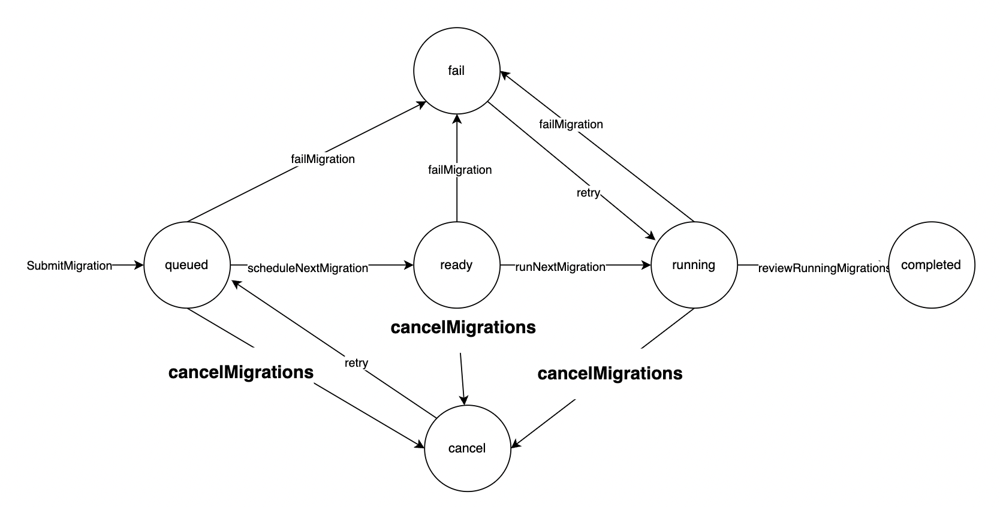

# **In-Depth Understanding of the Online DDL Scheduler**

## **Introduction**

The lifecycle of an online DDL begins once it is inserted into the **`schema_migration`** table. This article provides a detailed explanation of when state transitions occur and what actions the vttablet performs in each state.

## **States**

The states of online DDL include **`queued`**, **`ready`**, **`running`**, **`complete`**, **`fail`**, **`cancel`**, and **`pause`**.

- **`queued`**: Newly created online DDL, the initial state.
- **`ready`**: Online DDL prepared for execution.
- **`running`**: Online DDL in progress, including the creation of shadow tables, generation of select and insert statements, and initiation of Vreplication tasks.
- **`complete`**: Online DDL execution finished, entering this state after the cutover is complete.
- **`fail`**: Execution fails due to internal errors. Error details can be diagnosed using the **`message`** field with the corresponding uuid.
- **`cancel`**: WeSQL provides **`alter schema_migration`** to cancel an online DDL task. Tasks in this state can be re-executed using the **`retry`** command.
- **`pause`**: Currently under development, this feature can pause online DDL tasks in **`queue`**, **`ready`**, or **`running`** states.

State transition diagram (needs to be updated with the addition of **`pause`**):

## **Scheduling**

In the primary vttablet, a periodic task executes **`onMigrationCheckTick`** to update the status of the DDL. Each invocation of this function updates the current state of the state machine.

- **`queued`** → **`ready`**: In each Tick, only one online DDL task can move from **`queued`** to **`ready`**. This state is designed to support the **`postpone-complete`** feature, scheduling the **`queued`** online DDL with the smallest id to **`ready`**. Note that DDLs with **`-postpone-complete`** will not be scheduled in this cycle.
- **`ready`** → **`running`**: Transitioning from ready to running requires checking if any online DDL is currently running. By default, WeSQL allows only one DDL to be in the **`running`** state at a time. However, you can set the flag **`allow-concurrent`** for online DDLs to allow parallel execution. In parallel mode, vttablet checks if the scheduled DDL conflicts with those running, by checking if they perform DDL on the same table.
- **`running`** → **`complete`**: For simple DDLs like create and drop, no specific actions are required. For drop table operations, WeSQL internally has a tableGC function, refer to article…. For alter DDLs, during the transition from running to complete, a cutover takes place (using the newly created shadow table to replace the original table). For details on how the cutover is performed, refer to….
- **`status`** → **`fail`**: Any internal error causing the failure of online DDL execution will lead to the **`fail`** state. If in the **`fail`** state, the **`message`** corresponding to the online DDL's uuid can be checked for error diagnostics.
- **`status`** → **`cancel`**: Online DDL tasks canceled using the **`cancel`** command will enter this state. Executing **`retry`** will restart the DDL, but it will not resume from the breakpoint.

## **Timeline**

- When is the shadow table created for alter: The creation of shadow tables and other operations occur during the transition from **`ready`** to **`running`**.
- When does cutover for alter occur: The primary tablet performs cutover when the difference between the source table and the target (shadow table) falls below a certain threshold. This process will briefly lock the table.
- What is Vreplication doing during **`running`**: For specifics, refer to the document on Vreplication.