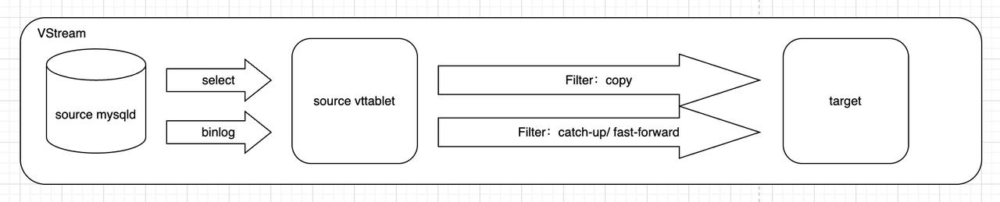
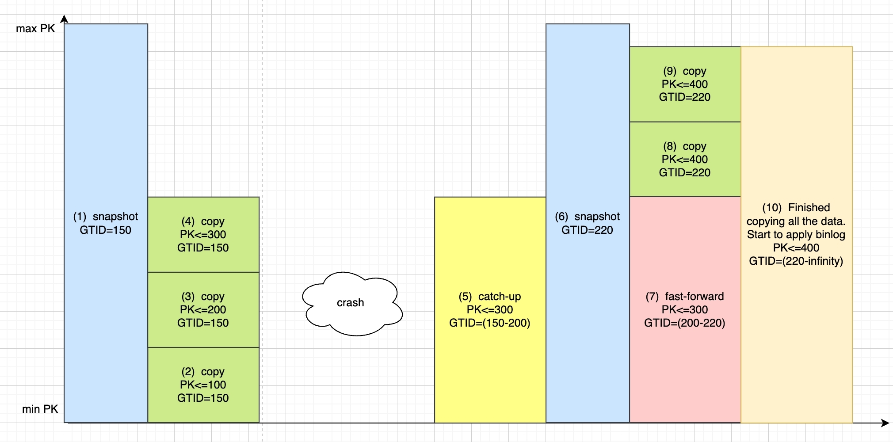

# **Vreplication**

## **Introduction**

Vitess incorporates a fundamental feature known as VReplication. It is extensively used in various data synchronization scenarios, including Online DDL, Resharding, MoveTable, MaterializeView, etc. VReplication can be conceptualized as an ETL pipeline between two logical tables. It is composed of one or several VStreams, with each VStream representing an ETL pipeline between two mysqld instances. This document aims to elucidate the internal details of VStream.

## **Structure**

The architecture of VStream is illustrated below. It creates a target table, synchronizes all data, and then replaces the source table.



When initiating a VStream, it first starts with a snapshot transaction to replicate the entire dataset, which might take a significant amount of time. It then commences the binlog for continuous incremental data synchronization. Once the latency between the source and target tables is sufficiently reduced, a cutover operation can be executed. During the data synchronization process, various transformation operations, such as filtering and projection, are possible. Additionally, VStream supports fault recovery, which adds a layer of complexity to its algorithm.

## **Principle**

To replicate data from a source table to a target table (both full and incremental), there's a straightforward approach:

1. Lock the source table; then, start a transaction with a consistent snapshot on the source table and release the lock afterward.
2. Read the snapshot data and copy it all to the target table. (Note that read-write transactions are still modifying data at this point.)
3. In the first step, we also obtain the transaction's GTID. Once the second step is completed, we can start replicating the binlog from the GTID position.
4. Continue replicating the binlog to the target table until the replication lag between the source and target is minimal.

This is the basic principle of the VReplication replication algorithm. VReplication builds on this with engineering optimizations and additional mechanisms to aid in crash recovery.

## **Complete Algorithm Description**

Building upon the simple algorithm described above, if we consider fault recovery, a naive idea would be to record the PK during copying and resume from the PK position in case of a fault. The process is as follows:

```bash
-- VReplication starts, replicating all data in the table through a snapshot
SNAPSHOT 1:
select * from X; -- GTID:150
<The target side consumes in bulk, inserting via bulk insert. It also records the highest inserted PK, for example, pk=300>

<crash ................>

SNAPSHOT 2:
select *from X where pk > 300; -- GTID: 200
<target side bulk consumption>
```

However, there's an issue here: Between SNAPSHOT 1 and SNAPSHOT 2, the GTID increased from 150 to 200, which might involve updates to the data where "PK<=300."

So, what can we do?

We can apply a fix: Before starting SNAPSHOT 2, read the binlog of "**`GTID>=150 and PK<=300`**" and replay it on the target side. The process is as follows:

```sql

-- VReplication starts, replicating all data in the table through a snapshot
SNAPSHOT 1: select * from X; -- GTID:150
COPY 1: <The target side consumes in bulk, inserting via bulk insert. It also records the highest inserted PK, for example, 300>

<crash ................>

This step is called catchup: apply binlog PK<=300, GTID>=150 -- apply continuously until catching up to the latest GTID, like 200. Then stop and continue copying. SNAPSHOT 2: select * from X where pk > 300; -- GTID: 220
COPY 2: <target side bulk consumption>
```

*(PS: The text with a green background represents a basic operation of the VReplication replication algorithm.)*

But then we discover another problem: After stopping the binlog application, and before SNAPSHOT 2, there's a time gap during which the data could have been modified.

What do we do then?

We can apply another fix: After starting SNAPSHOT 2 and before the target side starts consuming data, read the binlog of "**`200<=GTID<=220, PK<=300`**" and replay it on the target side. The process is as follows:

```sql

-- VReplication starts, replicating all data in the table through a snapshot
SNAPSHOT 1: select * from X; -- GTID:150
COPY 1: <The target side consumes in bulk, inserting via bulk insert. It also records the highest inserted PK, for example, 300>

<crash ................>

This step is called catchup: apply binlog: PK<=300, GTID>=150 -- apply continuously until catching up to the latest GTID, like 200. Then stop and continue copying. SNAPSHOT 2: select * from X where pk > 300; -- GTID: 220
This step is called fast-forward: apply binlog PK<=300, 200<=GTID<=220
COPY 2: <target side bulk consumption>

```

*(PS: The text with a green background represents a basic operation of the VReplication replication algorithm.)*

**An important conclusion we can draw is that after executing the fast-forward, the physical version of the data for PK<=300 will become the same as that in SNAPSHOT 2.**

Then, SNAPSHOT 2 can continue the copying process.

> A question to ponder: Why is the catchup step necessary? Can it be omitted?
>

## **Algorithm Flow Chart**

As described above, a typical VStream process is as follows, experiencing one crash recovery during the process. The numbers in parentheses indicate the order of operations.



(1) Start with repeatable read isolation level, initiating a consistent snapshot transaction.

(2)(3)(4): Perform full replication, copying data with PK≤300

crash: At this point, the server crashes for an unknown reason

(5): After service recovery, some SQL operations are executed, involving DML for PK≤300, necessitating a catch-up to update this data.

(6): Take another snapshot

(7): During the snapshot, more SQL updates might occur for rows ≤300, thus necessitating a fast-forward

(8)(9): Full replication, copying data with PK≤400

(10): Continuous binlog synchronization

Note: Snapshot 2 in (6) targets only data with PK>300. Hence, it's necessary to perform catch-up and fast-forward before and after it for data with PK<=300. Through catch-up and fast-forward, even after a crash, the data for PK<300 at the time of snapshot 2 will be as it was at GTID 220, ensuring that all data during snapshot 2 (PK<300, PK>=300) is up-to-date as of GTID 220.

Note: The pk<= numbers in (8)(9) in the diagram should not all be 400. These two processes represent continuing the replication from PK>300 after the fast-forward is completed.

## References
[Life of a Stream: How VReplication Replicates Data](https://vitess.io/docs/16.0/reference/vreplication/internal/life-of-a-stream/)

[Analyzing VReplication behavior](https://github.com/vitessio/vitess/issues/8056)

[RFC VStream Copy: streaming events from the beginning](https://github.com/vitessio/vitess/issues/6277)

[VSCopy: Resume the copy phase consistently from given GTID and lastpk](https://github.com/vitessio/vitess/pull/11103)