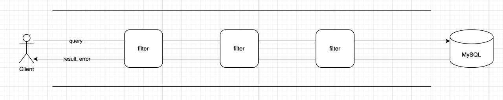
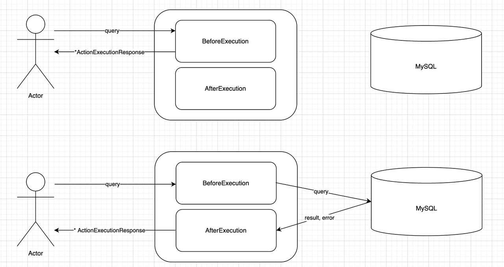

# Filters

- Feature: Filters
- Start Date: 2024-05-14
- Authors: @earayu

## **Introduction**

With the rise of microservices architecture, API Gateway is beginning to play an increasingly important role in complex systems. Most of the "common requirements" related to "RPC calls" are typically handled at the API Gateway layer, such as logging, protocol conversion, authentication, DDoS protection, rate limiting, etc.

To facilitate this, API Gateways often provide a "Filter pattern" that allows developers to easily implement these requirements. The essence of the Filter pattern is pattern matching combined with custom actions.

As a database proxy, WeScale has many similar requirements when handling user requests as those of an API Gateway. Therefore, we propose implementing a Filter framework in WeScale, inspired by the API Gateway's Filter pattern, enabling anyone to extend WeScale's functionality with simple code.

The specific process is as follows:
1. The user sends an SQL query, and based on the SQL information, several Filters are matched.
2. The SQL query passes through several Filters, each of which can modify the SQL information.
3. MySQL executes the SQL query.
4. The SQL query passes back through the Filters in reverse order and is then returned to the user.


## **Pattern Matching**

### Requirement 1: Collecting Information from SQL

We can gather a lot of information from SQL, which can generally be categorized into two types:

1. **Plan Specific Information**: Information that can be obtained from the SQL plan, such as SQL Type, Database Name, Table Name, SQL Template, etc.
2. **Execution Specific Information**: Information that can be obtained during the actual execution of a single SQL query, such as Client IP, UserName, specific parameters, and parameter values.

#### Plan Specific Information Includes
1. **SQL Type**: SELECT, UPDATE, INSERT, DELETE
2. **Object Type**: Database Name, Table Name, View Name
3. **SQL Template**: For example, `SELECT * FROM d1.t1 WHERE c1 = ? AND c2 = ?`

#### Execution Specific Information Includes
1. **User, Client IP**: For example, `foo@112.45.41.135`
2. **SQL Predicates**: For example, `c1 = 1`, `c2 >= 2`

### Requirement 2: Designing a High-Performance Rate Limiting Rule Matching Algorithm

#### A Naive Algorithm:
1. Suppose we have 100 rules, with an average of 3 criteria per rule.
2. For each SQL execution, we must check all 100 rules sequentially to see if they match.
3. This could potentially require up to 300 expression evaluations.

#### Optimized Algorithm with Plan Cache:
We know that each SQL execution undergoes "parameterization" (Normalization) and then "Plan Generation." When a similar SQL is received next time, it can directly fetch the Plan from the Cache instead of regenerating it.

Since we have categorized the SQL information into two types: Plan Specific Information and Execution Specific Information, we can optimize the naive algorithm as follows:

1. Suppose we have 100 rules, with an average of 2 Plan Specific criteria and 1 Execution Specific criterion per rule.
2. When the SQL "Plan" is generated for the first time, the rules filtered by the "Plan Specific criteria" are cached along with the Plan. Suppose this filtering leaves us with 10 rules.
3. During SQL execution, these 10 rules are directly retrieved from the Plan Cache and are matched sequentially against the "Execution Specific criteria."
4. This reduces the number of expression evaluations to approximately 10.

By leveraging Plan Cache and categorizing the rules, we can significantly reduce the computational load during SQL execution.


## Custom Action

As illustrated below, any Filter Action has two functions: `BeforeExecution` and `AfterExecution`. Their return values are both `ActionExecutionResponse`.

If the `BeforeExecution` function returns a non-empty `ActionExecutionResponse`, the query will not continue to propagate further but will instead return to the client. Therefore, if a Filter Action wants to return a mock result or an error, it can do so in this manner.

Each `AfterExecution` function has the opportunity to modify the value of `ActionExecutionResponse`, so it can also alter the result and error contents. Additionally, resource cleanup tasks can be performed within the `AfterExecution` function.



```Go
type ActionInterface interface {
    BeforeExecution(qre *QueryExecutor) *ActionExecutionResponse

    AfterExecution(qre *QueryExecutor, reply *sqltypes.Result, err error) *ActionExecutionResponse
}

type ActionExecutionResponse struct {
    Reply *sqltypes.Result
    Err   error
}
```
### Builtin Action

WeScale provides several Builtin Actions:

- **CONTINUE Action**: Does nothing.
- **FAIL Action**: Returns an error.
- **BUFFER Action**: Caches the SQL for a period of time.
- **CONCURRENCY_CONTROL Action**: Controls concurrency for the SQL.
- ......

Implementing a Filter Action is very simple. For example, adding concurrency control functionality to WeScale's main path with `ConcurrencyControlAction` requires only about 30 lines of core code.

### WASM Action
> To Be Designed, Coming Soon

With a powerful and flexible pattern matching capability, supporting user-defined actions (such as introducing WASM) will make the entire system very interesting.

