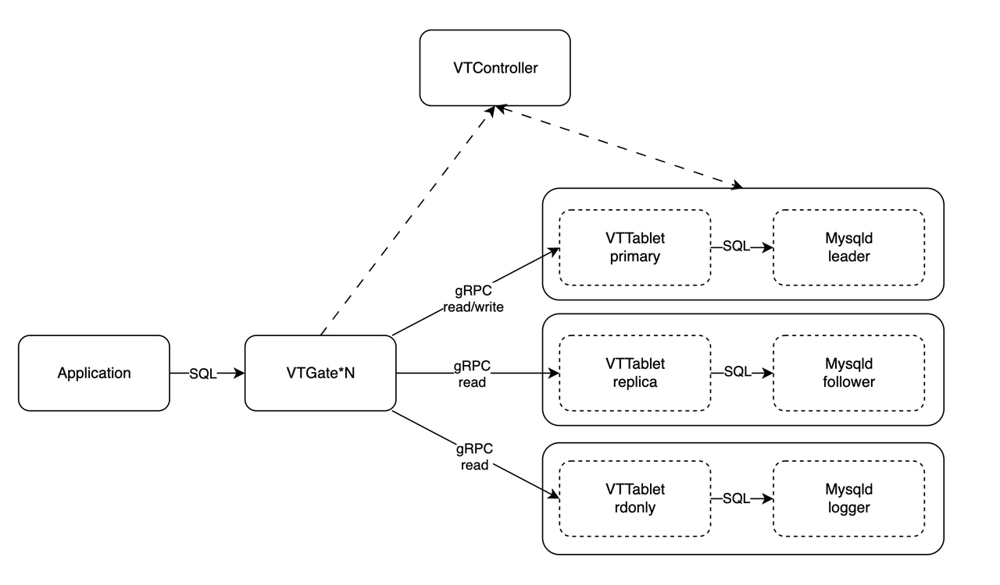

# Introduction
A database proxy is an essential tool for developers and database administrators to improve the scalability, performance, security, and resilience of their applications. 
WeSQL-Scale is a database proxy designed to be highly compatible with MySQL. It supports the MySQL wire protocol, read-write splitting without stale reads, connection pooling, and transparent failover. In this article, we will introduce you to WeSQL-Scale, explaining its architecture, key features, and benefits to help you understand why you might want to use it.

# Architecture
WeSQL-Scale is a fork of the Vitess project, we removed support for sharding in exchange for better SQL compatibility, for example, better support for subqueries, Common Table Expressions (CTE) and expression evluation. The below graph displays the architecture of a WeSQL-Scale cluster.
**VTGate**: Client application usually connects to VTGate via standard MySQL wire protocol. VTGate is stateless, which means it can be easily and effectively scaled in terms of size and performance. It acts like a MySQL and is responsible for parsing SQL queries, as well as planning and routing queries to VTTables. 
**VTTablet**: Typically, VTTablet is implemented as a sidecar for MySQL. If WeSQL-Scale is to be deployed in Kubernetes, then VTTablet should be in the same pod with MySQL. VTTablet accepts gRPC requests from VTGate and then sends those queries to be executed on MySQL. The VTTablet takes care of a few tasks such as permission checking and logging, but its most critical role is ensuring proper connection pooling.
**VTController**: The VTController component facilitates service discovery between VTGate and VTTablet, while also enabling them to store metadata about the cluster. If the role of MySQL changes, say from leaders to followers, the corresponding role of VTTablet should change accordingly. VTController checks the status of the MySQL cluster and sends commands to VTTablet to request that it changes roles. 

# Connection Pooling
Database connections consume memory, and to ensure that the buffer pool has enough memory, databases restrict the value of 'max_connections'. As applications are generally stateless and may need to rapidly scale-out, a large number of connections may be created, which can easily overload your database. So, these kinds of applications are not suitable for directly connecting to the MySQL server and creating a connection pool. 
Applications can create as many connections as they require with WeSQL-Scale, without needing to be concerned about max_connection errors. Because WeSQL-Scale will take over the establishment of a connection pool to the database, allowing applications to share and reuse connections at MySQL server side.  This reduces the memory and CPU overhead associated with opening and closing connections in the MySQL server-side, improving scalability and performance.
# Read Write Splitting
Using read-only nodes can significantly reduce the workload on the primary database node and improve resource utilization. However, managing multiple read-only nodes and deciding when to use each can be challenging for applications. WeSQL-Scale addresses this issue by offering three essential features: read-write-split, read-after-write consistency, and load-balancing. These features make it easier for applications to take advantage of read-only nodes effectively.
**Read-Write Split**: WeSQL-Scale simplifies application logic by automatically routing read queries to read-only nodes and write queries to the primary node. This is achieved by parsing and analyzing SQL statements, which improves load balancing and ensures efficient use of available resources.
**Read-After-Write Consistency**: This feature works in conjunction with read-write-split to maintain data consistency while still benefiting from performance improvements. When an application writes data to the primary node and subsequently reads it on a read-only node, WeSQL-Scale makes sure that the data that was just written to the primary node can be accessed and read from the read-only node.
**Load-Balancing**: WeSQL-Scale helps manage read-only nodes by routing queries to the appropriate node using various load balancing policies. This ensures that the workload is evenly distributed across all available nodes, optimizing performance and resource utilization.
# Transparent Failover
Failover is a feature designed to ensure that if the original database instance becomes unavailable, it is replaced with another instance and remains highly available. Various factors can trigger a failover event, including issues with the database instance or scheduled maintenance procedures like database upgrades.
Without WeSQL-Scale, a failover requires a short period of downtime. Existing connections to the database are disconnected and need to be reopened by your application. WeSQL-Scale is capable of automatically detecting failovers and buffering application SQL in its memory while keeping application connections intact, thus enhancing application resilience in the event of database failures. 
There is no way to completely solve the application-side connection error problem. However, the proxy is stateless and can be deployed with multiple nodes for high availability. Moreover, restart/recovery is usually way faster than the database, as it does not need to recover from the undo-redo log.
# Future Works
Databases have emerged to accommodate the common needs of applications. However, the development of application technology has significantly outpaced the development of traditional database kernels. In addition to the benefits mentioned above, we aim to implement more features to make databases more user-friendly for applications. This includes proxy-side authentication and authorization, SQL throttling, Online DDL, and so on.
# Conclusion
If you still have any questions after reading the content above, here is a simple checklist that can help you determine whether you can benefit from using WeSQL-Scale.
1. You have DB instances experiencing "too many connections" errors.
2. You have applications maintaining a substantial number of long-term connections.
3. You have applications that require rapid scaling, leading to a surge in database connections.
4. You have applications that need to use read-write separation and want to ensure consistency.
5. You have DB instances that require maintenance operations such as upgrades, and applications can not afford any downtime.
In conclusion, WeSQL-Scale is a powerful database proxy that can significantly enhance the scalability, performance, security, and resilience of applications. It helps address database connection issues and improve resource utilization through effective connection management, read-write separation and consistency, load balancing, and transparent failover features.