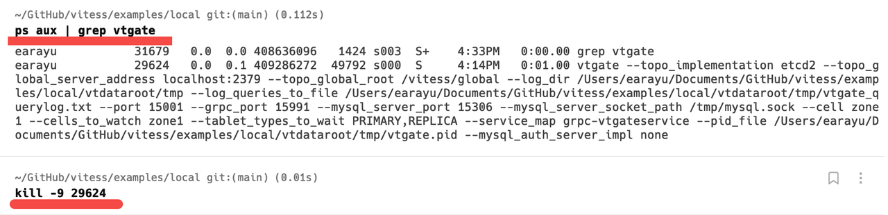
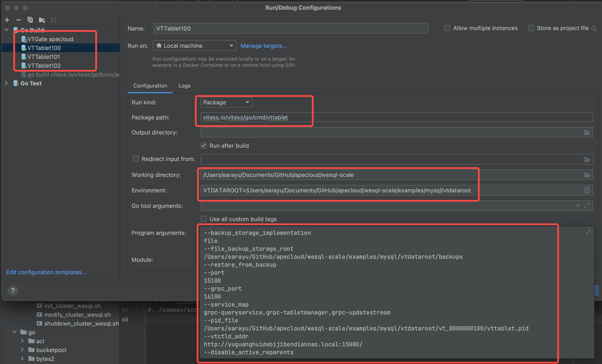

Start to deploy & debug a local cluster
=====================

This document explains how to start a WeSQL WeScale cluster on your local machine and begin debugging. We have made every effort to make this document intuitive and helpful for a successful deployment, but inevitably, you may encounter some corner cases that lead to failure. If you have any issues, please feel free to open an issue. We also welcome your help in improving the document if you are willing to do so.

# **Install Dependencies**

Start a WeSQL WeScale cluster locally, which relies on the following software: mysqld, mysql, go, etcd. You can use the following command to determine whether they have been installed.

```Bash
mysqld --version
mysql --version
go version
etcd --version
```

## **MacOS**

If you are using macOS, you can use Homebrew to install dependencies.

```Shell
brew install automake go mysql mysql-client etcd
```

When MySQL and etcd installs with brew it will start up automatically, you will want to shut this process down, as WeSQL WeScale will be managing the startup and shutdown of MySQL and etcd:

```Shell
brew services stop mysql
brew services stop etcd
```

## **Ubuntu**

If mysqld or etcd is not installed on your local machine, you can use the following command to install it.

As for Go, you can refer to this document for installation: https://go.dev/doc/install

```Shell
sudo apt-get update
sudo apt install -y mysql-server etcd 
```

## **Windows WSL**

Setting up the debugging environment on WSL needs extra operations, as some scripts may not run as a superuser. By default, WSL runs as a superuser, so we need to create an additional regular user. Here are the specific steps:

1. First, use the following commands to create a regular user:
```shell
useradd -m username   # Use -m to create a home directory for the user.
passwd username       # Change the password for the regular user.
usermod -aG sudo username  # Allow the user to use sudo.
```

2. Since the debugging environment is based on GoLand, and GoLand connects to the WSL terminal using the default WSL user, we need to change the default WSL user to the newly created regular user:
```shell
vim /etc/wsl.conf
# Add the following content:
[user]
default = username
```

Then, open PowerShell and shut down WSL:
```shell
wsl --list --running   # List running WSL instances.
wsl --shutdown name    # Replace 'name' with the name of the instance to shut down.
```

After this, when you enter WSL again, you will log in as the regular user. You will also notice that GoLand's terminal connects as the regular user.

3. Clone the source code again as the regular user, as the source code cloned by the superuser may have permission problems. Before cloning the source code, do not forget to generate an SSH public key for the regular user using `ssh-keygen` and configure it on GitHub.

# **Build & Install**

## **Pull Source Code**

```Shell
git clone https://github.com/wesql/wescale.git
cd wescale
```

## **Build**

You can call `make build` command to build the whole project. If the compilation is successful, you can use `ls bin` to see that many binary executable files have been generated.

```Shell
make build
```

## Install

It will take some time for WeSQL WeScale to build. Once it completes, you should see a bin folder which will hold the  WeSQL WeScale binaries. You will need to add this folder to your `PATH` variable, so that the command line can directly call the newly generated binary file.

```Shell
ls bin
export PATH={WeSQL WeScale-project-root-path}/bin:$PATH
```

# **Deploy** **&** **Debug**

You can deploy a WeSQL WeScale cluster locally by using the scripts in `wescale/examples/mysql` folder

## **Deploy**

```Shell
cd examples/mysql
./init_cluster.sh
```

Once the WeSQL WeScale cluster is successfully launched, you should see these messages:

```SQL
MySQL endpoint:
mysql -h127.0.0.1 -P17100
mysql -h127.0.0.1 -P17101
mysql -h127.0.0.1 -P17102

VTGate endpoint:
mysql -h127.0.0.1 -P15306
```

You can use the following command to connect to WeSQL WeScale

```Shell
mysql -h127.0.0.1 -P15306
```

## Debug

If you would like to debug `VTGate` or `VTTablet`, you may want to start them in IDE.

You can kill the vtgate/vttablet process started by the script and start vtgate/vttablet from an IDE for debugging. The program arguments can refer to the startup options of vtgate got from `ps aux` command:



There is a convenient way to help you start a local cluster for debugging purposes. You can add an environment variable `debug=on` when starting a cluster.

It will start a cluster first, then all vtgate and vttablet processes will be killed.

```Shell
debug=on ./init_cluster.sh
```

Let's take VTTablet as an example:

You should configure the `Run kind`、`Package path`、`Working directory`、`Environment` and `Program arguments`。

You can follow the settings in the picture, but remember to replace the file paths with the ones on your own computer. As stated previously, program arguments can be viewed by using the `ps aux` command.



However, when using the `ps aux` command to obtain information about the program arguments of `vttablet`, there is no argument value following the `--tablet_hostname` flag, which will lead an error in GoLand. You can obtain the hostname by running `hostname` in the terminal and then use it as the value of `hostname` flag.

## Shut down

Shutdown the cluster. If some of the processes fail to shutdown, you can kill all the processes manually and delete the `vtdataroot` directory.

```Shell
./shutdown_cluster.sh
```

