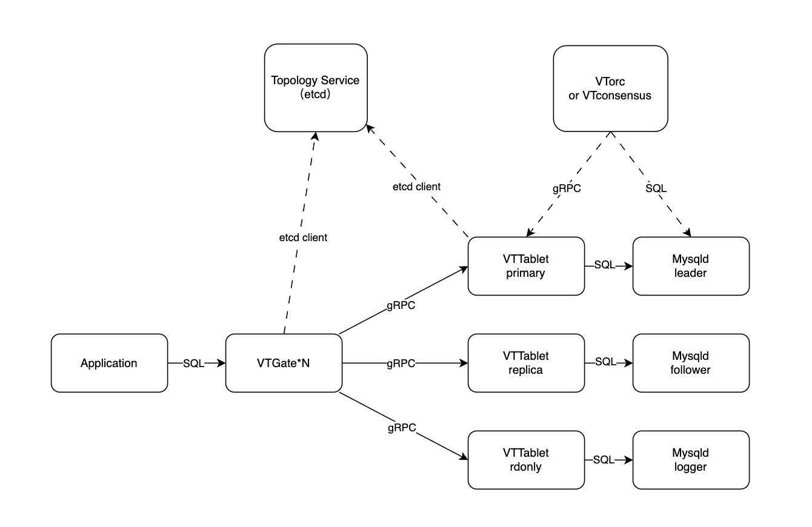

Architecture of WeSQL WeScale
=====================

WeSQL WeScale is an open-source database proxy project designed to be highly compatible with MySQL and other MySQL-compatible databases like MariaDB. It supports the MySQL wire protocol, read-write splitting based on SQL parsing technology, read-after-write consistency, load balancing, and connection pooling.
This documentation is intended to provide details about the architecture and essential components of a WeSQL WeScale cluster.

## Architecture
The below graph displays the architecture of a WeSQL WeScale cluster.
 

### VTGate
Client application usually connects to VTGate via standard MySQL wire protocol. VTGate is stateless, which means it can be easily and effectively scaled in terms of size and performance. It acts like a MySQL and is responsible for parsing SQL queries, as well as planning and routing queries to VTTables.
We have implemented some of the key features of WeSQL WeScale right here, such as Read-Write Splitter, Read-After-Write Consistency, and Load Balancer.
VTGate communicates to VTTablet via gRPC.

### VTTablet
Typically, VTTablet is implemented as a sidecar for mysqld. If WeSQL WeScale is to be deployed in Kubernetes, then VTTablet should be in the same pod with mysqld.
Similar to a high availability MySQL cluster, each VTTablet in the cluster has a role. The role of VTTablet should correspond, and change accordingly with the role of MySQL. VTOrc and VTConsensus will facilitate VTTablet's role shifting process, we will talk about this later.
VTTablet accepts gRPC requests from VTGate and then sends those queries to be executed on MySQL. The VTTablet takes care of a few tasks such as permission checking and logging, but its most critical role is ensuring proper connection pooling.

### Topology Service
The topology service component facilitates service discovery between VTGate and VTTablet, while also enabling them to store metadata about the cluster.
Usually, etcd is employed, however, any other storage service that implements the topology service API can serve the purpose.

### VTOrc & VTConsensus
If the role of MySQL changes, say from leaders to followers, the corresponding the role of VTTablet should change accordingly. VTOrc (used for replication topology), and VTConsensus (used for raft consensus topology) checkes the status of the MySQL cluster and send commands to VTTablet to request that it changes roles.
We may merge them into a single component in the future and integrate them into VTGate. This will make Deploy Topology simpler and allow VTGate and Vttablet to quickly detect role changes in MySQL.

### MySQL cluster
VTTablet sends SQL commands to a MySQL database to be executed. In order to ensure that the database remains available even if one node fails, the MySQL database architecture typically consists of a cluster of replicated nodes or a consensus cluster.
We aim to be inclusive of different versions and distributions of MySQL. Therefore, when we develop new features, we will take into account that the underlying MySQL may be Community Version, MariaDB, or other variations.
