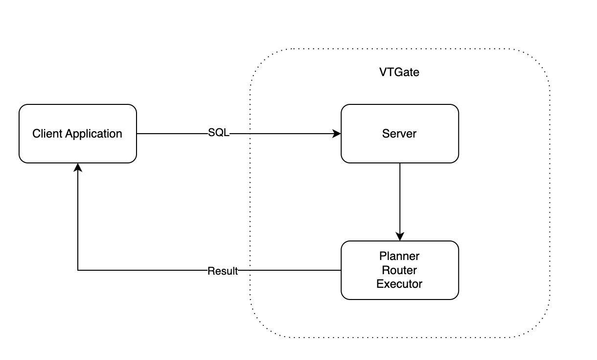
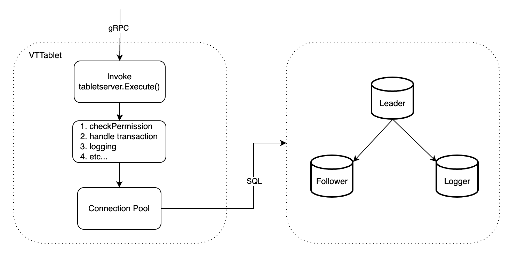

Life of A Query
=====================

* [From Client to VTGate](#from-client-to-VTGate)
* [From VTGate to VTTablet](#from-VTGate-to-VTTablet)
* [From VTTablet to MySQL](#from-VTTablet-to-mysql)
* [Putting it all together](#putting-it-all-together)

A query means a request for information from database and it involves four components in the case of Vitess, including the client application, VTGate, VTTablet and MySQL instance. This doc explains the interaction which happens between and within components.

At a very high level, as the graph shows, first the client sends a query to VTGate. VTGate then resolves the query and routes it to the right VTTablets. For each VTTablet that receives the query, it does necessary validations and passes the query to the underlying MySQL instance. After gathering results from MySQL, VTTablet sends the response back to VTGate. Once VTGate receives responses from VTTablets, it sends the result to the client. In the presence of VTTablet errors, VTGate will retry the query if errors are recoverable and it only fails the query if either errors are unrecoverable or the maximum number of retries has been reached.

## From Client to VTGate

VTGate acts like a MySQL for Client Applications. A client application first sends an SQL query to VTGate. VTGate's server parses SQL string to AST, then calls the planner, router, executor to execute the SQL, and finally return its result back to client.

## From VTGate to VTTablet

VTGate implements the MySQL wire protocol, which means it can behave like a MySQL database.
After receiving an SQL from the client and its `VTGate.Execute()` method being invoked, VTGate needs to parse the SQL into AST, then `Planner` will convert the `AST` to an `PLAN`. 
Due to VTGate being a database proxy, the backend is usually mapped to multiple VTTablets, and it needs to select one VTTablet to execute SQL. We have implemented features such as Read-Write-Split, Read-After-Write-Consistency, Load Balance in the Router module.
During execution stage, the Executor takes the `PLAN` and eventually sends gRPC requests to VTTablet to execute the queries.

## From VTTablet to MySQL

Once VTTablet received an gRPC call from VTGate, it does a few checks before passing the query to MySQL. First, it validates the current VTTablet state including the session id, then generates a query plan and applies predefined query rules and does ACL checks. It also checks whether the query hits the row cache and returns the result immediately if so. In addition, VTTablet consolidates duplicate queries from executing simultaneously and shares results between them. 
Finally, VTTablet will acquire a connection from the connection pool and pass the query down to MySQL layer and wait for the result.
The connection pool is the most important component of VTTablet.

## Putting it all together

