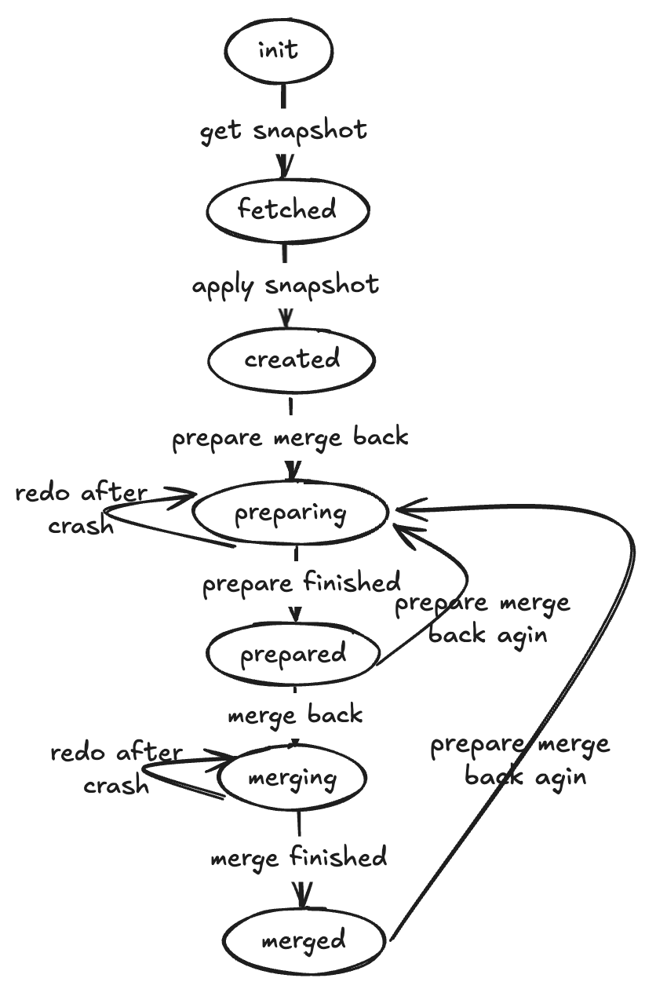

# Branch

## Overview

The Branch feature in WeSQL enables you to create a target database with the same schema as your source database. This approach allows you to safely develop and test new schema changes in isolation, without affecting the production environment. After validating these changes in the target environment, you can merge them back into the source database. This controlled workflow streamlines the evolution of your database schema.

---

## Prerequisites

### Create Clusters

To use the Branch feature, you need two WeScale clusters: a **source** cluster and a **target** cluster. The source cluster represents your production environment, while the target cluster serves as a safe testing environment.

For example, the following commands start a source cluster on port **15306** and a target cluster on port **15307**:

```shell
docker network create wescale-network

# Source cluster
docker run -itd --network wescale-network --name mysql-server \
  -p 3306:3306 \
  -e MYSQL_ROOT_PASSWORD=passwd \
  -e MYSQL_ROOT_HOST=% \
  -e MYSQL_LOG_CONSOLE=true \
  mysql/mysql-server:8.0.32 \
  --bind-address=0.0.0.0 \
  --port=3306 \
  --log-bin=binlog \
  --gtid_mode=ON \
  --enforce_gtid_consistency=ON \
  --log_replica_updates=ON \
  --binlog_format=ROW

docker run -itd --network wescale-network --name wescale \
  -p 15306:15306 \
  -w /vt/examples/wesql-server \
  -e MYSQL_ROOT_USER=root \
  -e MYSQL_ROOT_PASSWORD=passwd \
  -e MYSQL_PORT=3306 \
  -e MYSQL_HOST=mysql-server \
  -e CONFIG_PATH=/vt/config/wescale/default \
  apecloud/apecloud-mysql-scale:0.3.8 \
  /vt/examples/wesql-server/init_single_node_cluster.sh

# Target cluster
docker run -itd --network wescale-network --name mysql-server3307 \
  -p 3307:3307 \
  -e MYSQL_ROOT_PASSWORD=passwd \
  -e MYSQL_ROOT_HOST=% \
  -e MYSQL_LOG_CONSOLE=true \
  mysql/mysql-server:8.0.32 \
  --bind-address=0.0.0.0 \
  --port=3307 \
  --log-bin=binlog \
  --gtid_mode=ON \
  --enforce_gtid_consistency=ON \
  --log_replica_updates=ON \
  --binlog_format=ROW

docker run -itd --network wescale-network --name wescale15307 \
  -p 15307:15307 \
  -w /vt/examples/wesql-server \
  -e MYSQL_ROOT_USER=root \
  -e MYSQL_ROOT_PASSWORD=passwd \
  -e MYSQL_PORT=3307 \
  -e MYSQL_HOST=mysql-server3307 \
  -e VTGATE_MYSQL_PORT=15307 \
  -e CONFIG_PATH=/vt/config/wescale/default \
  apecloud/apecloud-mysql-scale:0.3.8 \
  /vt/examples/wesql-server/init_single_node_cluster.sh
```

### Initialize Data

```shell
# On the source side (port 15306)
$ docker exec -it wescale mysql -h127.0.0.1 -P15306

DROP DATABASE IF EXISTS test_db1;
DROP DATABASE IF EXISTS test_db2;
CREATE DATABASE test_db1;
CREATE DATABASE test_db2;

CREATE TABLE test_db1.users (
  id INT PRIMARY KEY AUTO_INCREMENT,
  username VARCHAR(50) NOT NULL,
  email VARCHAR(100) UNIQUE,
  created_at TIMESTAMP DEFAULT CURRENT_TIMESTAMP
);

CREATE TABLE test_db2.orders (
  order_id INT PRIMARY KEY AUTO_INCREMENT,
  customer_name VARCHAR(100) NOT NULL,
  order_date DATE NOT NULL,
  total_amount DECIMAL(10,2),
  status VARCHAR(20)
);
```

---

## Example Usage

In software development, testing schema changes directly in production is risky. By using Branch, you can duplicate your production schema into a target environment, apply and test changes there, and then merge these validated changes back into the source.

A typical workflow involves:
1. **Create**: Copying the schema from source to target.
2. **Modify**: Making schema changes safely in the target environment.
3. **Diff & Prepare**: Determining what changes are needed to align source with the target, and preparing these changes for merging.
4. **Merge Back**: Applying the tested schema changes to the source.

### Step 1: Branch Create

```sql
# On the target side (port 15307)
$ docker exec -it wescale15307 mysql -h127.0.0.1 -P15307

mysql> Branch create with (
    'source_host'='wescale',
    'source_port'='15306',
    'source_user'='root',
    'source_password'='passwd',
    'include_databases'='*',
    'exclude_databases'=''
);
Query OK, 0 rows affected (0.214 sec)
```

```sql
# On the target side (port 15307)
mysql> Branch show;
+-----------+---------+-------------+-------------+-------------+---------+--------------------------------------------------------------------------+
| name      | status  | source host | source port | source user | include | exclude                                                                  |
+-----------+---------+-------------+-------------+-------------+---------+--------------------------------------------------------------------------+
| my_branch | created | wescale     | 15306       | root        | *       | information_schema,mysql.performance_schema,sys,mysql,performance_schema |
+-----------+---------+-------------+-------------+-------------+---------+--------------------------------------------------------------------------+
1 row in set (0.010 sec)
```

```sql
# On the target side (port 15307)
mysql> show databases;
+--------------------+
| Database           |
+--------------------+
| information_schema |
| mysql              |
| performance_schema |
| sys                |
| test_db1           |
| test_db2           |
+--------------------+
6 rows in set (0.001 sec)
```

### Step 2: Modify Schema in the Target

```sql
# On the target side (port 15307)
ALTER TABLE test_db1.users ADD COLUMN phone VARCHAR(20);
ALTER TABLE test_db1.users ADD INDEX idx_phone (phone);

ALTER TABLE test_db2.orders ADD COLUMN payment_type VARCHAR(20);
ALTER TABLE test_db2.orders ADD INDEX idx_date_status (order_date, status);

CREATE TABLE test_db2.products (
    product_id INT PRIMARY KEY AUTO_INCREMENT,
    product_name VARCHAR(200) NOT NULL,
    price DECIMAL(10,2) NOT NULL,
    stock INT DEFAULT 0,
    status VARCHAR(20) DEFAULT 'on_sale',
    created_at TIMESTAMP DEFAULT CURRENT_TIMESTAMP
);
```

### Step 3: Branch Diff

```sql
# On the target side (port 15307)
mysql> Branch diff\G
```

This command lists the SQL statements required to update the source schema to match the target.

### Step 4: Branch Prepare Merge Back

```sql
# On the target side (port 15307)
Branch prepare_merge_back;
```

### Step 5: Branch Merge Back

```sql
# On the target side (port 15307)
Branch merge_back;
```

After this operation completes, check the schema on the **source** cluster to confirm that it now includes all the target’s changes:

```sql
# On the source side (port 15306)
SHOW DATABASES;
SHOW TABLES FROM test_db1;
SHOW TABLES FROM test_db2;
```

Since both environments should now be in sync, you can run `Branch diff` again on the **target** side:

```sql
# On the target side (port 15307)
Branch diff;
```

This time, the diff should produce no output, indicating that the source and target schemas are identical.

---

## Additional Details

### Idempotency

Branch commands are idempotent, meaning you can re-run them if something goes wrong partway through. For example, if `Branch create` fails after retrieving the schema but before applying it, simply execute `Branch create` again to resume.

**Note on `Branch merge_back` Idempotency:**  
Each time `Branch merge_back` runs, it attempts to apply any “unmerged” DDLs. In the event of a crash, some DDLs might be applied on the source without being marked as merged. Future enhancements will improve the handling of these scenarios.

### State Transitions

A branch progresses through several states:

- **Init**: Branch creation has started.
- **Fetched**: Source schema snapshot has been captured.
- **Created**: Snapshot applied to the target.
- **Preparing**: Generating the DDL statements for merging back.
- **Prepared**: DDL statements are saved, ready to merge.
- **Merging**: DDL statements are being applied to the source.
- **Merged**: All DDL statements successfully applied.

