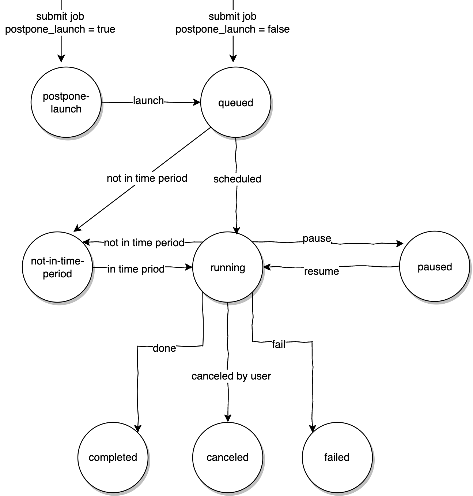

## Use Cases
When you need to execute a large Data Manipulation Language (DML) operation, executing it directly may lead to **memory overflow** or excessive consumption of computational resources, **affecting the performance of other important SQL operations**.

In such cases, you might consider splitting the large DML into several smaller DMLs, with a time interval between each execution to avoid the mentioned issues.

You might also want certain DMLs to be executed only at specific times of the day to avoid peak business hours.

If you have these requirements, you might want to try **Non-Transactional DML**.
## Quick Overview of Non-Transactional DML
### DML Splitting
Non-Transactional DML involves splitting a DML operation into several smaller DMLs, and the method of splitting is easy to understand:

The entire Non-Transactional DML task is called a **job**, and each smaller DML task is called as a **batch**. Each batch has a specified **batchSize**, indicating the maximum number of rows the batch DML will affect.

After you submits a DML, the rows will affected by the DML are sorted based on the primary key (PK) of the table. Every **batchSize** rows form a batch, as a result, each batch has a range of PK values, and the PK range conditions for each batch are added to the original DML to generate the DML SQL for each batch.

For example:
```sql  
+----+------+  
| id | age  |  
+----+------+  
|  1 |   15 |  
|  3 |   10 |  
|  6 |   20 |  
|  7 |   45 |  
|  9 |   56 |  
| 10 |   28 |  
| 12 |    2 |  
| 15 |   23 |  
+----+------+  
  
id is the primary key and batchSize is 3  
  
the origin sql is: delete from mytable where age >= 10;  
  
and then wescale will create three batches for this job,as follows:  
  
batch 0: delete from mytable where age >= 10 and id >= 1 and id <= 6;  
batch 1: delete from mytable where age >= 10 and id >= 7 and id <= 10;  
batch 2: delete from mytable where age >= 10 and id >= 15 and id <= 15;  
  
```  

If you do not perform specific modification on the DML tables during the execution of batches, the combined effect of all batch DMLs is equivalent to the original DML.
### Non-Transactional
As the name suggests, **Non-Transactional DML does not guarantee the ACID of the transaction**.

For example, if an original DML was intended to delete 100 records and batchSize is 50. We will get two batches, each deleting 50 records, means that other transactions might see the intermediate results of the deletion, breaking the **isolation** of the transaction.

And if it fails after executing the first batch, the 50 records already deleted cannot be recovered, and the remaining 50 records still exist, breaking the **atomicity** of the transaction.

In summary, Non-Transactional DML essentially serves as **a splitting service**, helping you break down DML into batches.

Batch execution is also managed by a **throttler** to prevent impacting major SQL traffic (see the Control section for details).

Non-Transactional DML provides a set of commands for you to monitor and control the execution process. And you should be aware that Non-Transactional DML does not guarantee transactional properties.
## Usage
Non-Transactional DML offers commands for you to submit, monitor, and control DML jobs.

The key to using Non-Transactional DML effectively is understanding the DML splitting process and be aware that it does not guarantee transactional properties.

Therefore, during Non-Transactional DML execution, **it's essential to ensure that your application code does depend on the transactional properties of the DML**.
### Submission
Currently, Non-Transactional DML supports two DML operations: **update** and **delete**.

To submit a Non-Transactional DML job, simply add a comment to the original DML:
```sql  
delete/*vt+ dml_split=true */ from mytable where age >= 10;  
update/*vt+ dml_split=true */ mytable set age = 60 where age >= 10;  
```  

The comment `dml_split=true` informs `wescale` to treat this DML as a Non-Transactional DML job.

During submission, you can also choose other parameters:

| Directive                | Description                                                                                               |  
|--------------------------|-----------------------------------------------------------------------------------------------------------|  
| DML_BATCH_INTERVAL       | Interval between batch executions, measured in milliseconds.                                              |  
| DML_BATCH_SIZE           | Number of rows affected by each batch.                                                                    |  
| DML_POSTPONE_LAUNCH      | Indicates whether to postpone the execution of the DML job.                                                  |  
| DML_FAIL_POLICY          | Policy for handling batch failures.see the **Failure Policy** section for details  |  
| DML_TIME_PERIOD_START    | Specifies the earliest time for DML execution.                                        |  
| DML_TIME_PERIOD_END      | Specifies the latest time for DML execution.                                          |  
| DML_TIME_PERIOD_TIME_ZONE | Specifies the time zone.                                            |  

For example:
```sql  
delete /*vt+ dml_split=true dml_batch_interval=1000 dml_batch_size=3 */ from mytable where age>=10;  
```  

This job executes every 1 second, affecting a maximum of 3 rows in each batch, and the job is scheduled immediately after submission, and if a batch fails, the strategy is to pause the job. The job can run at any time.

After successful submission, you will receive a UUID for the job, along with information about the batch, including the `batch info table name`, `batch execution interval`, `batch size`, `failure policy`, and `whether to postpone scheduling`.
### Monitoring
You can view all jobs using the following command:

```sql  
show dml_jobs \G;  
```  

You can also check the details of a specific job:
```sql  
show dml_job 'job_uuid' \G;  
```  

Adding `details` allows you to view the batch info table for the job:
```sql  
show dml_job 'job_uuid' details \G;  
```  

The job table has various fields with the following explanations:

| Field                           | Description                                                                                                                   |  
|---------------------------------|-------------------------------------------------------------------------------------------------------------------------------|  
| job_uuid                        | Unique identifier for the DML job.                                                                                            |  
| table_schema                    | The database where the DML related table is located.                                                                  |  
| table_name                      | Name of the DML related table.                                                                                        |  
| batch_info_table_schema         | Database where the batch info table is located.                                                                              |  
| batch_info_table_name           | Name of the batch info table.                                                                                                 |  
| status                          | Current status of the job.                                                                                                   |  
| status_set_time                 | Time when the status field was set.                                                                                          |  
| time_zone                       | Time zone of the status_set_time.                                                                                             |  
| message                         | Messages set by the DML job controller during runtime.                                                                      |  
| dml_sql                         | SQL submitted by the user.                                                                                                   |  
| batch_interval_in_ms            | Interval between batch executions.                                                                                           |  
| batch_size                      | Maximum number of rows affected by each batch.                                                                               |  
| fail_policy                     | Action to take if a batch fails. Currently supports skip, abort, and pause.                                                  |  
| batch_concurrency               | Batch concurrency (currently not supported, set to 1).                                                                       |  
| affected_rows                   | Total number of rows currently affected by the job.                                                                         |  
| throttle_ratio                  | Throttling ratio.                                                                                                            |  
| throttle_expire_time            | Expiration time for throttling.                                                                                              |  
| dealing_batch_id                | Current batch ID being processed.                                                                                            |  
| running_time_period_start       | Earliest time for DML execution.                                                                                             |  
| running_time_period_end         | Latest time for DML execution.                                                                                               |  
| running_time_period_time_zone   | Time zone for DML execution.                                                                                                 |  


The batch info table has various fields with the following explanations:

| Field                           | Description                                                                                                                   |  
|---------------------------------|-------------------------------------------------------------------------------------------------------------------------------|  
| batch_id                        | ID for each batch, starting from 1. If it has a "-", the batch is created by **automatic batch splitting**.                        |  
| batch_status                    | Execution status of the batch.                                                                                                |  
| count_size_when_creating_batch  | Estimated number of rows the batch will affect when created.                                                                 |  
| actually_affected_rows          | Actual number of rows affected when executing the batch.                                                                     |  
| batch_begin                     | Minimum value of the primary key (PK) in the PK range of the batch (comma-separated if multiple PKs).                        |  
| batch_end                       | Maximum value of the primary key (PK) in the PK range of the batch (comma-separated if multiple PKs).                        |  
| batch_sql                       | SQL that will be executed by the batch.                                                                                                   |  
| batch_count_sql_when_creating_batch | used to estimate the number of affected rows before batch execution.  |  
### Scheduling Mechanism
The dml job controller is the core component of the non-transactional dml feature, maintaining tables processed by each job that is doing or has finished preparing.

The job status include `submitted`, `preparing`, `postpone-launch`, `queued`, `not-in-time-period`, `running`, `paused`, `canceled`, `completed` and `failed`.

When a new job is submitted, it will be set as `submiited`. If the table it modifies are not in of the table set maintained by the job controller, the job will be set as `preparing` status and start creating batch info table.

After batch info table are created, the job will be set to `queued` or `postpone-launch` according to the value of` DML_POSTPONE_LAUNCH`.

A `queued` job will be set as `running` if it's within the running time period. Otherwise, it will transition to `not-in-time-period` status.

Users can set a running job to `paused` or `canceled`. A `running` job that completes successfully enters the `completed` status. If there is a failure during execution, the job enters the `failed` state.

If two jobs process different tables, they can run in parallel. Currently, there is no limit to the number of jobs that can run in parallel.

Here is a status transition diagram for jobs.


### Control
#### Postpone Launch
When submitting a Non-Transactional DML, you might not want it to be executed immediately. Instead, you may prefer to schedule the job for execution after confirming that all things are right.

In such cases, set the `DML_POSTPONE_LAUNCH` field to true when submitting the dml job:
```sql  
delete /*vt+ dml_split=true dml_postpone_lanch=true */ from mytable where age>=10;  
```  

This job, although submitted, will be postponed for scheduling. When you want to start scheduling the job, use the following SQL:
```sql  
alter dml_job 'job_uuid' launch  
```  

#### Pause and Resume
When a job is in the running state, you can use the following SQL to pause it:
```sql  
alter dml_job 'job_uuid' pause  
```  

When a dml job is paused, the table it involves are still retained in the job controller's data structure. This means that if there is a new dml job later attempting to modify these tables, it will be blocked.

When you want to resume the job, use the following SQL:
```  
alter dml_job 'job_uuid' resume  
```  
#### Cancel
When a job is in the running state, you can use the following SQL to cancel it in advance:
```sql  
alter dml_job 'job_uuid' cancel  
```  

When a dml job is canceled, unlike pausing, all metadata related to it (such as modified tables) will be deleted.
#### Throttling
Before executing each batch, a request is sent to the `wescale throttler`. If the throttler determines that the traffic load on the `wescale cluster` is high, the batch execution is temporarily delayed until the cluster's traffic load decreases.

Of course, you can also manually specify the probability of throttling and the effective time for each batch.

**During job submission**:
```  
delete /*vt+ dml_split=true dml_throttle_ratio=number dml_throttle_duration=duration   */ from mytable where age>=10  
```  

For example:
```sql  
delete /*vt+ dml_split=true dml_throttle_ratio=1 dml_throttle_duration=30m   */ from mytable where age>=10  
```  

This completely throttles the job for thirty minutes. If neither ratio nor duration is specified, the ratio is 0, and the duration is empty. If only the ratio is specified, the default duration is 100\*365\*24 hours. If only the duration is specified, the default ratio is 1.

**During job execution**:
```sql  
alter dml_job 'job_uuid' throttle expire 'duration' ratio number   
```  

For example:
```sql  
alter dml_job 'job_uuid' throttle expire '30m' ratio 0.9  
```  

This means that for the next thirty minutes, there is a 90% probability of delaying each batch execution.

When you want to cancel the throttling probability and time for a batch, use the following SQL:
```sql  
alter dml_job 'job_uuid' unthrottle  
```  
#### Time Period
When you want a job to execute only during a specific time interval, you can set a time period for the job:

During job submission:
```sql  
delete /*vt+ dml_split=true dml_time_period_start=18:00:00 dml_time_period_end=19:00:00 dml_time_period_time_zone=UTC+08:00:00 */ from mytable where age>=10;  
```  

This specifies that the job should only run between `18:00:00` and `19:00:00` each day, with a time zone of `UTC+08:00:00` (if not specified, it defaults to the system's default time zone).

During job execution:
```sql  
alter dml_job 'job_uuid' time_period 'start_time' 'end_time' 'time_zone'  
  
alter dml_job 'job_uuid' time_period '18:00:00' '19:00:00' 'UTC+08:00:00'  
```  

When the end time is earlier than the start time, the end time is increased by one day, for example:
```sql  
alter dml_job 'job_uuid' time_period '23:00:00' '06:00:00'  
```  

This means the job will run from 11:00 PM to 6:00 AM the next day.
#### Failure Policy
When a batch execution fails, there are several strategies: skip, abort, and pause.
- **Skip**: Skips the current batch if it fails and proceeds to the next batch.
- **Abort**: Marks the entire job as failed if the current batch fails.
- **Pause**: Marks the entire job as paused if the current batch fails.

You can specify the failure policy when submitting the job, with the default being pause:
```sql  
delete /*vt+ dml_split=true dml_fail_policy=pause */ from mytable where age>=10;   
```  

The above SQL sets the failure policy to pause when submitting the job. In this case, if a batch fails, the job will be paused. At this point, you can check the message field in the job table, attempt to fix the error, and use the resume command to continue the job.

Additionally, when the failure policy is set to skip, if a batch is skipped due to failure, its status will be set to skip, along with an error message.
## Automatic Batch Splitting During Runtime

When each batch is created, the `count_size_when_creating_batch` field records the estimated number of rows the batch will affect. For batches created during job submission, this field's value equals the batch size.

Before executing each specific batch, a select count statement is used to obtain the number *N* of rows that the batch will affect. If *N* is greater than the batch size, the batch will be automatically split. The first **batchSize** rows are assigned to the **current batch**, and the remaining *N-batchSize* rows are assigned to a **new batch**.

The batch id for automatically generated new batches is special and includes a "-".

If a new batch is created by batch id "x", the new batch id will be "x-2." If a new batch is created by batch id "x-y", the new batch id will be "x-y+1".

The automatic splitting mechanism ensures that the size of each batch does not exceed the batchSize, avoiding potential out-of-memory issues caused by unexpected increases in batch size.

The automatic splitting is performed automatically by `wescale`, requiring no intervention.