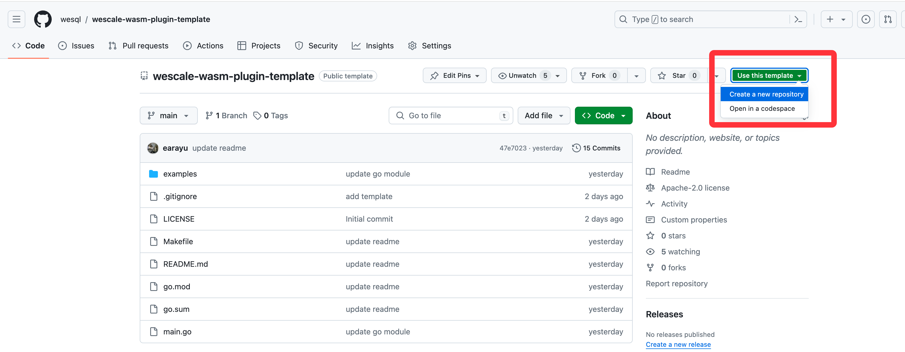
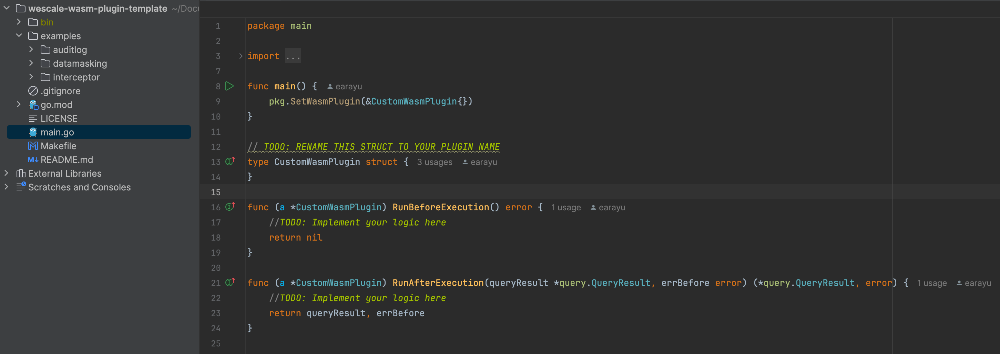

# Introduction
Most platform software provides a certain degree of extensibility. Just as MySQL allows users to write UDFs to extend functionality, WeScale also allows users to write Filters to achieve the same purpose. However, this is still not a very user-friendly way for most users because it requires them to compile and distribute their own code along with the code provided by the service provider.

A better way would be: modern browsers provide extensibility, allowing users who want deep customization to write browser extensions, while users who want shallow customization can use plugins like Tampermonkey to inject JavaScript code to change browser behavior.

Therefore, based on Filter, WeScale proposes the concept of Wasm Plugin. We hope that Wasm Plugin can provide our users with more secure, dynamic and easy-to-use extensibility.

Before we start, I recommend you read the [design document](..%2Fdesign%2F20240531_WasmPlugin.md) to understand the design of Wasm Plugin.

# Clone the WeScale-Wasm-Plugin-Template
We've prepared a template for you to write your Wasm Plugin. You can clone it from 
[WeScale-Wasm-Plugin-Template](https://github.com/wesql/wescale-wasm-plugin-template) and follow the instructions 
in the README.md to write your Wasm Plugin.


# Write Your Code
The structure of the template is simple. You can write your code directly in the `main.go` file. 
And you can see the example code in the `examples` directory. There's a `Makefile` to help you build and deploy the Wasm binary.


Let's say you want to write a Wasm Plugin to intercept the DML queries which do not have a WHERE clause.

The first step is to acquire the query from the host environment. You can use the `hostfunction.GetHostQuery` function to get the query.
All the functions provided by the host environment are defined in the `host_functions` package. 
```go
func (a *CustomWasmPlugin) RunBeforeExecution() error {
	query, err := hostfunction.GetHostQuery()
	if err != nil {
		return err
	}

	return nil
}
```

The next step is to recognize if the query is a DML query and check if it has a WHERE clause. If it doesn't have a WHERE clause, you can return an error.
Luckily, you can import a third-party library to parse the SQL query and check if it meets the requirements.
Now the code looks like this:
```go
import (
    "fmt"
    "github.com/wesql/wescale-wasm-plugin-sdk/pkg"
    hostfunction "github.com/wesql/wescale-wasm-plugin-sdk/pkg/host_functions/v1alpha1"
    "github.com/wesql/wescale-wasm-plugin-sdk/pkg/proto/query"
    "github.com/xwb1989/sqlparser"
)

func (a *CustomWasmPlugin) RunBeforeExecution() error {
	query, err := hostfunction.GetHostQuery()
	if err != nil {
		return err
	}

	stmt, err := sqlparser.Parse(query)
	if err != nil {
		hostfunction.InfoLog("parse error: " + err.Error())
		return nil
	}
	switch stmt := stmt.(type) {
	case *sqlparser.Update:
		if stmt.Where == nil {
			return fmt.Errorf("no where clause")
		}
	case *sqlparser.Delete:
		if stmt.Where == nil {
			return fmt.Errorf("no where clause")
		}
	default:
	}

	return nil
}
```

We have nothing to do in the `RunAfterExecution` function, so we can leave it empty.

```go
func (a *CustomWasmPlugin) RunAfterExecution(queryResult *query.QueryResult, errBefore error) (*query.QueryResult, error) {
	return queryResult, errBefore
}
```

So that's it! You've written a Wasm Plugin to intercept DML queries without a WHERE clause.
You can find the complete code in the `examples/interceptor` directory.

# Compile and Deploy
You can find the detailed steps to compile and deploy the Wasm Plugin in the `README.md` of the template repository.
But here's a brief summary:
1. Build the Wasm binary by running the `make build` command.
```bash
make build WASM_FILE=my_plugin.wasm
```

2. Deploy the Wasm Plugin to WeScale by running the `wescale_wasm` binary.
```bash
# install the wescale_wasm binary, it will help you deploy the plugin
make install-wescale-wasm

# deploy the plugin
./bin/wescale_wasm --command=install --wasm_file=./bin/my_plugin.wasm --mysql_host=127.0.0.1 --mysql_port=15306 --mysql_user=root --mysql_password=root
```

3. Check the status of the plugin.
```bash
$ mysql -h127.0.0.1 -P15306 -e 'show filters\G'
*************************** 1. row ***************************
                         id: 47
           create_timestamp: 2024-05-31 18:27:50
           update_timestamp: 2024-05-31 18:27:50
                       name: my_plugin_wasm_filter
                description:
                   priority: 1000
                     status: ACTIVE
                      plans: ["Select","Insert","Update","Delete"]
fully_qualified_table_names: []
                query_regex:
             query_template:
           request_ip_regex:
                 user_regex:
      leading_comment_regex:
     trailing_comment_regex:
             bind_var_conds:
                     action: WASM_PLUGIN
                action_args: wasm_binary_name="my_plugin.wasm"
```

4. Now you can test the plugin by running some DML queries with and without a WHERE clause.
```go
$ mysql -h127.0.0.1 -P15306 -e '/*explain filter*/delete from mysql.user'
+-----------------------+-------------+----------+-------------+-----------------------------------+
| Name                  | description | priority | action      | action_args                       |
+-----------------------+-------------+----------+-------------+-----------------------------------+
| my_plugin_wasm_filter |             | 1000     | WASM_PLUGIN | wasm_binary_name="my_plugin.wasm" |
+-----------------------+-------------+----------+-------------+-----------------------------------+

$ mysql -h127.0.0.1 -P15306 -e 'delete from mysql.user'
ERROR 1105 (HY000) at line 1: target: .0.primary: vttablet: rpc error: code = Unknown desc = error from wasm plugin at after execution stage: error from wasm plugin at before execution stage: no where clause (CallerID: userData1)
```

5. If you want to remove the plugin, you can run the following command.
```bash
./bin/wescale_wasm --command=uninstall --filter_name=my_plugin_wasm_filter
```